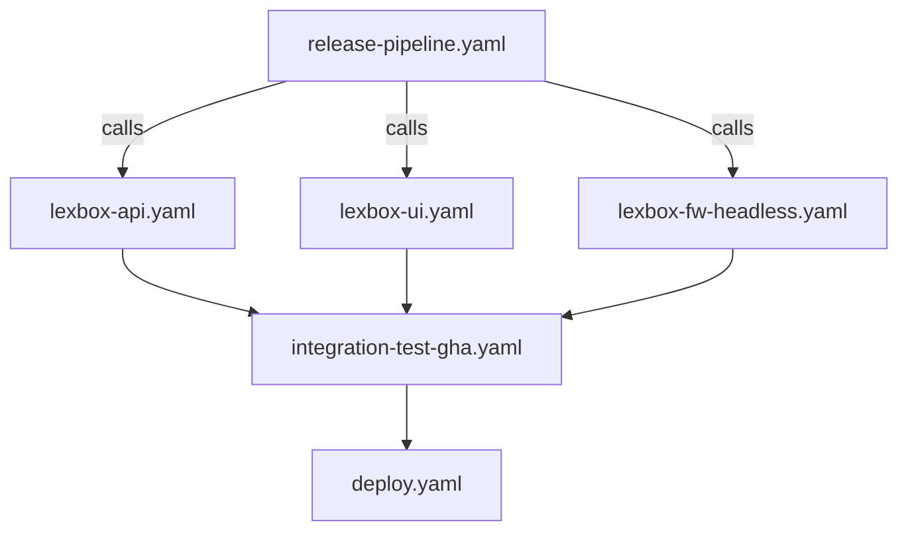
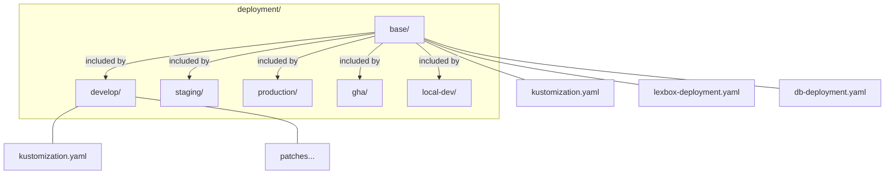

# CI/CD and Deployment

This document helps agents understand the GitHub Actions workflows and deployment infrastructure.

## ⚠️ WARNING: Complexity Ahead

The CI/CD setup is:
- **Complex** - Many interdependent workflows
- **Slow** - Full runs can take 30-60+ minutes
- **Fragile** - Flaky tests, timing issues, external dependencies
- **Expensive** - Windows runners, multiple platforms

**Before modifying workflows:**
1. Understand which workflows depend on each other
2. Test changes on a branch first
3. Consider if changes will increase build times
4. Check if the change needs to work across multiple OS/platforms

---

## Workflow Overview

### Build Workflows (Build + Test)

| Workflow | Triggers | What it does | Time |
|----------|----------|--------------|------|
| `fw-lite.yaml` | FwLite code changes | Build .NET, run tests, build viewer, publish apps | ~40 min |
| `lexbox-api.yaml` | Called by others | Build API, run unit tests, build Docker image | ~15 min |
| `lexbox-ui.yaml` | Called by others | Build SvelteKit UI, build Docker image | ~10 min |
| `lexbox-fw-headless.yaml` | Called by others | Build FwHeadless Docker image | ~10 min |
| `lexbox-hgweb.yaml` | Called by others | Build hgweb Docker image | ~5 min |

### Integration & Deploy Workflows

| Workflow | Triggers | What it does |
|----------|----------|--------------|
| `integration-test.yaml` | Called by others | Run integration tests against environment |
| `integration-test-gha.yaml` | API/UI changes | Spin up K8s in GHA, run integration tests |
| `deploy.yaml` | Called by others | Deploy to K8s environment via fleet repo |
| `deploy-branch.yaml` | Manual | Deploy feature branch to develop |
| `release-pipeline.yaml` | develop/main push | Orchestrate build → test → deploy |

### Development Workflows

| Workflow | Purpose |
|----------|---------|
| `develop-api.yaml` | Quick API build for PRs |
| `develop-ui.yaml` | Quick UI build for PRs |
| `develop-fw-headless.yaml` | Quick FwHeadless build for PRs |

---

## Known Flaky CI Failures (re-run before debugging)

The `GHA integration tests / dotnet` check (`integration-test-gha.yaml`) fails in two known ways that are NOT regressions. Re-run first (`gh run rerun <runId> --failed`) — especially on frontend-only or dependency-only PRs, which can't affect the lexbox-api / hg / fw-headless containers it exercises:

1. **cert-manager readiness timeout** — `setup-k8s` waits `--timeout=90s` for cert-manager pods; on a cold kind cluster they don't always make it → deploy aborts fast (~3 min) and the status step logs "No resources found in languagedepot namespace". Environmental — tends to hit all branches in the same window.
2. **MediaFileTests large-upload stream error** — `Testing.FwHeadless.MediaFileTests.UploadReplacementFile_TooLarge_ThrowsError` intermittently throws `HttpRequestException: Error while copying content to a stream` (transient connection drop streaming the large file) instead of the expected validation error. Shows as Failed: 1 / Passed: ~146 after the full ~14 min run.

Also expected, not a failure: on frontend-only PRs the backend image-publish workflows (`lexbox-fw-headless`, `lexbox-hgweb`) don't trigger (path filters), so `setup-k8s` gets `manifest unknown` pulling those images at the PR version and falls back to the `develop` tag via `continue-on-error`. Those log lines are noise.

Separately: a PR whose merge state is CONFLICTING silently *skips* the build/test checks rather than failing them — if expected checks are missing, reconcile with develop first.

---

## Workflow Dependencies

### FwLite is Separate

`fw-lite.yaml` is **independent** from the main LexBox workflows:
- Core .NET build/tests run on Linux (`FwLiteCore.slnf`); MAUI build/tests on Windows only
- Has its own test suite
- Publishes standalone apps, not Docker images
- Does NOT deploy to K8s

---

## Key Concepts

### Workflow Calls vs. Triggers

- `workflow_call` - Can be called by other workflows (reusable)
- `workflow_dispatch` - Manual trigger from GitHub UI
- `push` / `pull_request` - Automatic triggers

Most build workflows use `workflow_call` so they can be composed.

### Docker Images

All Docker images go to `ghcr.io/sillsdev/`:
- `lexbox-api`
- `lexbox-ui`
- `lexbox-fw-headless`
- `lexbox-hgweb`

Images are tagged with:
- Branch name (`develop`, `main`)
- PR number (`pr-123`)
- Commit SHA
- `latest` (for main branch)

### Environments

| Environment | Domain | When deployed |
|-------------|--------|---------------|
| `develop` | develop.lexbox.org | Every develop push |
| `staging` | staging.languagedepot.org | Manual |
| `production` | lexbox.org | Manual with approval |

---

## Deployment Architecture

### Fleet Repo Pattern

Deployments work via a **separate fleet repository**:

1. Workflow builds Docker image
2. Workflow runs `kubectl kustomize` to generate `resources.yaml`
3. Workflow clones fleet repo
4. Workflow copies `resources.yaml` and updates image tag
5. Workflow pushes to fleet repo
6. K8s cluster watches fleet repo and applies changes

This separation provides:
- Audit trail of all deployments
- Ability to rollback by reverting fleet repo
- GitOps pattern

### Kustomize Structure

**Folder purposes:**
- `base/` - Shared K8s manifests
- `develop/` - Develop environment overlays
- `staging/` - Staging environment overlays  
- `production/` - Production environment overlays
- `gha/` - GitHub Actions K8s (for integration tests)
- `local-dev/` - Local development

Each environment folder:
- Includes `base/` via kustomization
- Applies environment-specific patches
- Sets environment-specific config

---

## Common Tasks

### "Add a new environment variable"

1. Add to `deployment/base/app-config.yaml` (if shared)
2. Or add to `deployment/<env>/app-config.yaml` (if env-specific)
3. Reference in deployment yaml if needed

### "Add a new service/container"

1. Create deployment yaml in `deployment/base/`
2. Add to `deployment/base/kustomization.yaml`
3. Add any env-specific patches

### "Speed up a workflow"

Consider:
- Can tests run in parallel? (`matrix` strategy)
- Can we cache dependencies? (pnpm, nuget, docker layers)
- Can we skip unnecessary steps? (`if` conditions)
- Is the runner appropriate? (ubuntu vs windows)

### "Add integration tests"

⚠️ **This is hard.** Integration tests require:
1. K8s cluster (kind in GHA or real cluster)
2. All services running
3. Test data seeded
4. Network access between services

See `integration-test-gha.yaml` for the pattern (it's complex).

---

## FwLite CI Details (`fw-lite.yaml`)

This is the most complex workflow because it:
- Builds core .NET on Linux, MAUI on Windows
- Builds viewer (Node.js)
- Runs Playwright tests
- Publishes for 5 platforms (Windows, Mac x64, Mac ARM, Linux x64, Linux ARM)

### Jobs

| Job | Runner | Purpose |
|-----|--------|---------|
| `build-and-test` | ubuntu-latest | Core .NET build + tests (`FwLiteCore.slnf`) |
| `frontend` | ubuntu-latest | Build viewer, Playwright snapshots |
| `frontend-component-unit-tests` | ubuntu-latest | Vitest unit tests |
| `publish-mac` | macos-latest | macOS binaries |
| `publish-linux` | ubuntu-latest | Linux binaries |
| `publish-win` | windows-latest | MAUI tests, Windows MAUI publish + MSIX |

### Solution filters

- `FwLiteCore.slnf` — CI fast path (no MAUI projects)
- `FwLiteOnly.slnf` — local full build including MAUI

### Why Windows for MAUI?

.NET MAUI Windows builds require the Windows SDK. Can't build Windows MAUI targets on Linux.

### Artifacts

The workflow produces:
- `fw-lite-viewer-js` - Built viewer (shared by publish jobs)
- `fw-lite-web-mac` - macOS binaries
- `fw-lite-web-linux` - Linux binaries
- `fw-lite-windows-exe` - Windows binaries
- `fw-lite-maui-msix` - MAUI installer

---

## Troubleshooting

### "Workflow is slow"

1. Check which job is slow (expand in GitHub UI)
2. Look for:
   - Missing caches
   - Unnecessary rebuilds
   - Sequential steps that could be parallel
   - Large downloads

### "Flaky test failures"

1. Check if test uses timing/sleeps
2. Check if test depends on external service
3. Check if test has race conditions
4. Look at retry patterns in workflow

### "Deployment didn't happen"

1. Check deploy job ran (may need approval)
2. Check fleet repo was updated
3. Check K8s cluster pulled changes
4. Check health endpoint: `https://<domain>/api/healthz`

### "Docker build failed"

1. Check Dockerfile syntax
2. Check if base image exists
3. Check if all files needed are in build context
4. Check if secrets are available (ghcr.io login)

---

## Files Reference

### Workflows

| File | Purpose |
|------|---------|
| `.github/workflows/fw-lite.yaml` | FwLite complete CI |
| `.github/workflows/lexbox-api.yaml` | API Docker build |
| `.github/workflows/lexbox-ui.yaml` | UI Docker build |
| `.github/workflows/deploy.yaml` | Deploy to K8s |
| `.github/workflows/release-pipeline.yaml` | Orchestrate release |
| `.github/workflows/integration-test-gha.yaml` | Integration tests in GHA |

### Deployment

| File | Purpose |
|------|---------|
| `deployment/base/kustomization.yaml` | Base K8s resources |
| `deployment/<env>/kustomization.yaml` | Env overlays |
| `deployment/gha/` | K8s config for GHA tests |

### Docker

| File | Purpose |
|------|---------|
| `backend/Dockerfile` | API image |
| `frontend/Dockerfile` | UI image |
| `backend/FwHeadless/Dockerfile` | FwHeadless image |
| `hgweb/Dockerfile` | hgweb image |

---

## E2E Tests for FwLite

⚠️ **This is an area of active work and known difficulty.**

Challenges:
- FwLite is a desktop app (MAUI) or web app (ASP.NET)
- Needs real backend services for meaningful tests
- Cross-platform testing is expensive
- Test data management is complex

Current state:
- Unit tests in `FwLiteCore.slnf` (CI) / `FwLiteOnly.slnf` (local, includes MAUI)
- Playwright snapshot tests for viewer
- No full E2E tests in CI yet

If working on E2E tests:
1. Start simple (single platform, happy path)
2. Mock external services where possible
3. Use test fixtures for data
4. Consider cost/time tradeoffs
5. Document what's tested and what's not
