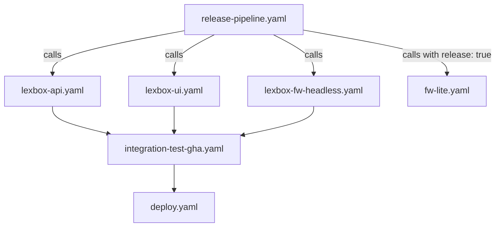
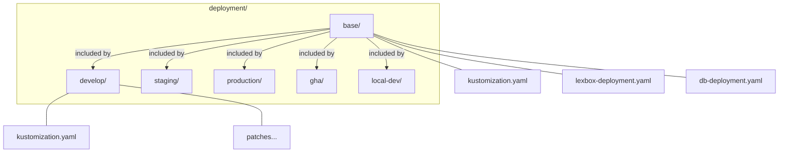

# CI/CD and Deployment

GitHub Actions workflows and deployment. Full runs take 30-60+ min across Linux, Windows and macOS runners, so try workflow changes on a branch.

## 🔒 Cluster Access and Privacy (non-negotiable)

- **NEVER access a k8s cluster without explicit permission** for that specific cluster — no `kubectl`, `helm`, `k9s`, port-forwards, or log pulls. Production requires an instruction that explicitly names production. The only exception is a throwaway local cluster (e.g. kind) you started yourself.
- **Never push to the fleet repo** — pushing there IS deploying.
- **Everything from a real environment is private.** Logs, DB contents, project codes, project/language names, user names: none of it goes into GitHub issues/PRs/comments or anywhere else online. Full rules in the root `AGENTS.md` (🔒 Privacy and Production Access).

---

## Workflow Overview

### Build Workflows (Build + Test)

| Workflow | Triggers | What it does | Time |
|----------|----------|--------------|------|
| `fw-lite.yaml` | FwLite code changes | Build .NET, run tests, build viewer, publish apps | ~40 min |
| `lexbox-api.yaml` | Called by others | Build API, run unit tests, build Docker image | ~15 min |
| `lexbox-ui.yaml` | Called by others | Build SvelteKit UI, build Docker image | ~10 min |
| `lexbox-fw-headless.yaml` | Called by others | Build FwHeadless Docker image | ~10 min |
| `lexbox-hgweb.yaml` | Called by others | Build hgweb Docker image | ~5 min |

### Integration & Deploy Workflows

| Workflow | Triggers | What it does |
|----------|----------|--------------|
| `integration-test.yaml` | Called by others | Run integration tests against environment |
| `integration-test-gha.yaml` | API/UI changes | Spin up K8s in GHA, run integration tests |
| `deploy.yaml` | Called by others | Deploy to K8s environment via fleet repo |
| `deploy-branch.yaml` | Manual | Deploy feature branch to develop |
| `release-pipeline.yaml` | Manual dispatch (develop only) | Release LexBox (build → test → deploy, then a `lexbox-v<date>-<sha>` GitHub release) and FW Lite with one shared version |

### Development Workflows

| Workflow | Purpose |
|----------|---------|
| `develop-api.yaml` | Quick API build for PRs |
| `develop-ui.yaml` | Quick UI build for PRs |
| `develop-fw-headless.yaml` | Quick FwHeadless build for PRs |

---

## Reading CI

Start with `.github/scripts/ci-logs.sh <run-id|run-or-job-url> [job-name-substring]`. It lists the jobs, then per failed job prints the failed steps, the `##[error]` lines and the lines before the first one, and saves the clean full log to a temp file (path printed). It works mid-run, where `gh run view --log-failed` refuses until the whole run ends and pads its output with `UNKNOWN STEP` setup noise. `--artifacts <dir>` downloads the integration tests' `*-k8s-logs` (pod describe + logs, usually the only real cause) and greps them for image-pull, OOM and probe failures.

- **Checks missing on a PR**: a CONFLICTING PR schedules none. Check `gh pr view <n> --json mergeable,statusCheckRollup` before waiting; merge develop first.
- **`startup_failure`** (no jobs, no annotations): the workflow YAML was rejected, e.g. a nested job asking for permissions its caller lacks. Run `actionlint`; the message is only on the run page.
- **Waiting**: one `gh run watch <id> -R sillsdev/languageforge-lexbox --exit-status` in the background (Monitor). Sleep loops hit the 10-minute Bash timeout.
- **Flaky or systemic?** `gh run list -R sillsdev/languageforge-lexbox -w "<workflow name>" -b develop --limit 5 --json conclusion`. Failing on develop too means systemic: not your PR, and a re-run won't help.

### Known flaky (ask the user to re-run once)

1. **cert-manager webhook CA race** (`GHA integration tests / dotnet`): `ClusterIssuer` apply fails with `x509: certificate signed by unknown authority` ~3 min in, pods still `ContainerCreating`. `setup-k8s` now waits for all cert-manager deployments plus `cmctl check api --wait=2m`; a rare repeat is still a flake.
2. **`MediaFileTests.UploadReplacementFile_TooLarge_ThrowsError`**: `HttpRequestException: Error while copying content to a stream` instead of the validation error (Failed: 1 / Passed: ~146).

### Known systemic (re-running won't help)

- **`ErrImagePull ... not found` for `lexbox-api`/`lexbox-ui`** in the k8s logs: images publish only for branches on `origin`. A fork PR, or a branch never pushed to origin, can't pass integration tests; ask the user to push the branch to origin.
- Not a failure: on frontend-only PRs `setup-k8s` logs that `lexbox-fw-headless`/`lexbox-hgweb` are unpublished at the PR version and keeps the `develop` tag (path filters skip those builds).

## Agent GitHub access

`gh` runs as a bot account (`gh api user --jq .login`; scopes in `gh auth status`). Git pushes go through Git Credential Manager, not `gh`. Hand the user the exact command for anything marked "no".

| Operation | Bot | Notes |
|---|---|---|
| Read runs, logs, artifacts, PRs, issues | yes | Pass `-R sillsdev/languageforge-lexbox` outside a checkout (`gh run download` fails with "not a git repository" without it) |
| Push to `origin` (sillsdev) | no | pull-only; a 403 push means the bot identity, so stop and ask |
| `gh workflow run`, `gh run rerun` | no | 403 |
| GHCR packages API | no | no `read:packages` scope |
| PRs on other sillsdev repos (e.g. chorus) | no | "must be a collaborator"; give the user the branch and PR body |

## Gotchas

- Workflows mix `.yml` (`codeql.yml`) and `.yaml`; glob `.github/workflows/*.y*ml`.
- `-p:` values containing `,` or `;` split into separate MSBuild switches (MSB1006): quote the whole `"-p:Name=a;b"` or write `;` as `%3B`.
- Multi-RID builds keep `RuntimeIdentifiers` in the csproj; a global `-p:RuntimeIdentifier(s)` leaks into referenced libraries (NETSDK1083). See the Mac Catalyst step in `fw-lite.yaml`.
- Log and artifact upload steps use `if: failure() || cancelled()`; `failure()` alone skips them when a job times out.
- .NET preview container images: use the `11.0` MCR tag; `11.0-preview` stopped tracking new previews.

## PR review feedback

Read freely; reply or resolve only when the user asks (public, see 🔒 above).

- Threads with resolution state: GraphQL `repository.pullRequest.reviewThreads { nodes { id isResolved path comments { nodes { databaseId body } } } }`. REST `gh api repos/sillsdev/languageforge-lexbox/pulls/<n>/comments` has the comments but no thread state.
- Reply: `gh api -X POST repos/sillsdev/languageforge-lexbox/pulls/<n>/comments/<comment-id>/replies -f body=...`.
- Resolve: GraphQL mutation `resolveReviewThread(input: {threadId: "<PRRT_...>"})`.
- PR branch "already used by worktree": `git checkout -B work origin/<branch>`, later `git push origin HEAD:<branch>`.

---

## Workflow Dependencies

```mermaid
flowchart TD
    RP[release-pipeline.yaml] -->|calls| API[lexbox-api.yaml]
    RP -->|calls| UI[lexbox-ui.yaml]
    RP -->|calls| FWH[lexbox-fw-headless.yaml]
    RP -->|calls with release: true| FWL[fw-lite.yaml]
    
    API --> IT[integration-test-gha.yaml]
    UI --> IT
    FWH --> IT
    
    IT --> DEP[deploy.yaml]
```

### FwLite

`fw-lite.yaml` runs on its own for CI (develop pushes, PRs, manual dispatch). Releases call it from `release-pipeline.yaml` with `release: true` and the shared `version`/`semver-version`; that's the only way to publish the GitHub/Play Store release. Its own manual dispatch can't release (it declares no inputs). The LexBox and FW Lite releases run in parallel; neither blocks the other.

- Core .NET build/tests run on Linux (`FwLiteCore.slnf`); MAUI build/tests on Windows only
- Has its own test suite
- Publishes standalone apps, not Docker images
- Does NOT deploy to K8s

---

## Key Concepts

### Docker Images

All Docker images go to `ghcr.io/sillsdev/`:
- `lexbox-api`
- `lexbox-ui`
- `lexbox-fw-headless`
- `lexbox-hgweb`

Images are tagged with:
- Branch name (`develop`)
- PR number (`pr-123`)
- Commit SHA
- `latest` (release pipeline)

### Environments

| Environment | Domain | When deployed |
|-------------|--------|---------------|
| `develop` | develop.lexbox.org | Every develop push |
| `staging` | staging.languagedepot.org | Manual |
| `production` | lexbox.org | Manual with approval |

---

## Deployment Architecture

### Fleet Repo Pattern

Deployments work via a **separate fleet repository**:

1. Workflow builds Docker image
2. Workflow runs `kubectl kustomize` to generate `resources.yaml`
3. Workflow clones fleet repo
4. Workflow copies `resources.yaml` and updates image tag
5. Workflow pushes to fleet repo
6. K8s cluster watches fleet repo and applies changes

This separation provides:
- Audit trail of all deployments
- Ability to rollback by reverting fleet repo
- GitOps pattern

### Kustomize Structure

```mermaid
flowchart TD
    subgraph deployment/
        BASE[base/] -->|included by| DEV[develop/]
        BASE -->|included by| STG[staging/]
        BASE -->|included by| PROD[production/]
        BASE -->|included by| GHA[gha/]
        BASE -->|included by| LOCAL[local-dev/]
    end
    
    BASE --- B1[kustomization.yaml]
    BASE --- B2[lexbox-deployment.yaml]
    BASE --- B3[db-deployment.yaml]
    
    DEV --- D1[kustomization.yaml]
    DEV --- D2[patches...]
```

**Folder purposes:**
- `base/` - Shared K8s manifests
- `develop/` - Develop environment overlays
- `staging/` - Staging environment overlays  
- `production/` - Production environment overlays
- `gha/` - GitHub Actions K8s (for integration tests)
- `local-dev/` - Local development

Each environment folder:
- Includes `base/` via kustomization
- Applies environment-specific patches
- Sets environment-specific config

---

## Common Tasks

### "Add a new environment variable"

1. Add to `deployment/base/app-config.yaml` (if shared)
2. Or add to `deployment/<env>/app-config.yaml` (if env-specific)
3. Reference in deployment yaml if needed

### "Add a new service/container"

1. Create deployment yaml in `deployment/base/`
2. Add to `deployment/base/kustomization.yaml`
3. Add any env-specific patches

---

## FwLite CI Details (`fw-lite.yaml`)

This is the most complex workflow because it:
- Builds core .NET on Linux, MAUI on Windows
- Builds viewer (Node.js)
- Runs Playwright tests
- Publishes for 5 platforms (Windows, Mac x64, Mac ARM, Linux x64, Linux ARM)

### Jobs

| Job | Runner | Purpose |
|-----|--------|---------|
| `build-and-test` | ubuntu-latest | Core .NET build + tests (`FwLiteCore.slnf`) |
| `frontend` | ubuntu-latest | Build viewer, Playwright snapshots |
| `frontend-component-unit-tests` | ubuntu-latest | Vitest unit tests |
| `build-apple` | macos-latest | MAUI Release builds for iOS simulator + Mac Catalyst; signs Mac Catalyst with the SIL Developer ID and notarizes a DMG when the signing secret is present (upstream), else unsigned compile check (fork PRs) |
| `launch-mac` | macos-latest + macos-15-intel | Checks Gatekeeper accepts the notarized DMG, then launches the app on each CPU and waits for its "Viewer loaded" log line (upstream only; gates `create-release`) |
| `publish-linux` | ubuntu-latest | Linux binaries |
| `publish-win` | windows-latest | MAUI tests, Windows MAUI publish + MSIX; launches the portable exe and waits for its "Viewer loaded" log line |
| `create-release` | ubuntu-latest | Release runs only (`release: true`): GitHub release `v<date>-<sha>` with the installers; notes from `.github/release-fw-lite.yml` via `.github/actions/release-notes`, which also gives the Lexbox release its own range |

### Solution filters

- `FwLiteCore.slnf` — CI fast path (no MAUI projects)
- `FwLiteOnly.slnf` — local full build including MAUI

### Artifacts

The workflow produces:
- `fw-lite-viewer-js` - Built viewer (shared by publish jobs)
- `fw-lite-apple` - iOS simulator .app (zipped) + the universal (Intel + Apple Silicon) notarized Mac Catalyst `FieldWorksLite.dmg` (or an unsigned arm64 Mac Catalyst .app zip on fork PRs)
- `fw-lite-web-linux` - Linux binaries
- `fw-lite-portable` - Windows portable app
- `fw-lite-msix` - MAUI installer

---

## Files Reference

### Deployment

| File | Purpose |
|------|---------|
| `deployment/base/kustomization.yaml` | Base K8s resources |
| `deployment/<env>/kustomization.yaml` | Env overlays |
| `deployment/gha/` | K8s config for GHA tests |

### Docker

| File | Purpose |
|------|---------|
| `backend/Dockerfile` | API image |
| `frontend/Dockerfile` | UI image |
| `backend/FwHeadless/Dockerfile` | FwHeadless image |
| `hgweb/Dockerfile` | hgweb image |
