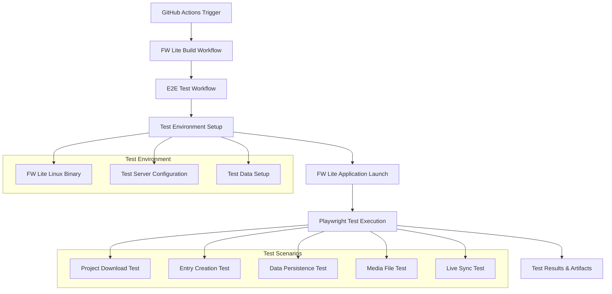
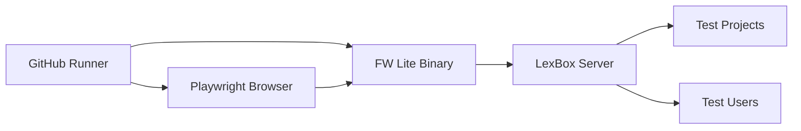

# Design Document

## Overview

The FW Lite E2E Testing Framework provides automated end-to-end testing for FW Lite integration with LexBox. The system uses Playwright for UI automation and integrates with the existing GitHub Actions CI/CD pipeline to ensure critical workflows continue to function after code changes.

The framework follows the existing testing patterns established in the project, extending the current Playwright setup in `frontend/viewer` to include full application testing scenarios that span the entire FW Lite to LexBox integration workflow.

## Architecture

### High-Level Architecture



### Workflow Integration

The E2E tests integrate with the existing CI/CD pipeline by:

1. **Triggering after successful FW Lite builds** - Uses the `needs` dependency in GitHub Actions
2. **Consuming build artifacts** - Downloads the Linux FW Lite binary from the previous workflow
3. **Configurable server targeting** - Can run against different environments (local, staging, production)
4. **Artifact preservation** - Uploads test results, screenshots, and logs for debugging

### Test Environment Architecture



## Components and Interfaces

### 1. GitHub Actions Workflow (`fw-lite-e2e-tests.yaml`)

**Purpose**: Orchestrates the E2E testing process
**Location**: `.github/workflows/fw-lite-e2e-tests.yaml`

**Key Features**:
- Triggers after successful `publish-linux` job in fw-lite workflow
- Downloads FW Lite Linux artifacts
- Sets up test environment with configurable server endpoints
- Executes Playwright tests
- Uploads test results and failure artifacts

**Configuration Interface**:
```yaml
env:
  TEST_SERVER_HOSTNAME: ${{ vars.TEST_SERVER_HOSTNAME || 'localhost:5137' }}
  TEST_PROJECT_CODE: 'sena-3'
  TEST_DEFAULT_PASSWORD: ${{ secrets.TEST_USER_PASSWORD || 'pass' }}
  FW_LITE_BINARY_PATH: './fw-lite-linux/linux-x64/FwLiteWeb'
```

### 2. Playwright Test Suite

**Purpose**: Implements the actual E2E test scenarios
**Location**: `frontend/viewer/tests/e2e/`

**Test Structure**:
```
frontend/viewer/tests/e2e/
├── fw-lite-integration.test.ts     # Main integration test
├── helpers/
│   ├── fw-lite-launcher.ts         # FW Lite application management
│   ├── project-operations.ts       # Project download/management helpers
│   └── test-data.ts               # Test data constants and utilities
└── fixtures/
    └── test-projects.json         # Expected test project configurations
```

### 3. FW Lite Application Manager

**Purpose**: Manages FW Lite application lifecycle during tests
**Location**: `frontend/viewer/tests/e2e/helpers/fw-lite-launcher.ts`

**Interface**:
```typescript
interface FwLiteManager {
  launch(config: LaunchConfig): Promise<void>
  shutdown(): Promise<void>
  isRunning(): boolean
  getBaseUrl(): string
}

interface LaunchConfig {
  binaryPath: string
  serverUrl: string
  port?: number
  timeout?: number
}
```

### 4. Test Data Management

**Purpose**: Provides consistent test data and expectations
**Location**: `frontend/viewer/tests/e2e/helpers/test-data.ts`

**Interface**:
```typescript
interface TestProject {
  code: string
  name: string
  expectedEntries: number
  testUser: string
}

interface TestEntry {
  lexeme: string
  definition: string
  partOfSpeech: string
  uniqueIdentifier: string
}
```

## Data Models

### Test Configuration Model

```typescript
interface E2ETestConfig {
  server: {
    hostname: string
    protocol: 'http' | 'https'
    port?: number
  }
  fwLite: {
    binaryPath: string
    launchTimeout: number
    shutdownTimeout: number
  }
  testData: {
    projectCode: string
    testUser: string
    testPassword: string
  }
  timeouts: {
    projectDownload: number
    entryCreation: number
    dataSync: number
  }
}
```

### Test Result Model

```typescript
interface TestResult {
  testName: string
  status: 'passed' | 'failed' | 'skipped'
  duration: number
  error?: string
  screenshots: string[]
  logs: string[]
}
```

## Error Handling

### Application Launch Failures

- **Timeout handling**: If FW Lite fails to start within the configured timeout, the test fails with clear error messaging
- **Port conflicts**: Automatic port detection and retry logic
- **Binary validation**: Pre-flight checks to ensure the FW Lite binary exists and is executable

### Network and Server Issues

- **Connection retries**: Implement exponential backoff for server connection attempts
- **Server availability checks**: Validate server endpoints before starting tests
- **Graceful degradation**: Skip tests that require unavailable services with clear reporting

### Test Data Issues

- **Project availability**: Verify expected test projects exist before running tests
- **User authentication**: Handle authentication failures with clear error messages
- **Data conflicts**: Implement cleanup strategies for test data conflicts

### Playwright-Specific Error Handling

```typescript
// Example error handling pattern
try {
  await page.waitForSelector('[data-testid="project-list"]', { timeout: 30000 })
} catch (error) {
  await page.screenshot({ path: 'failure-project-list.png' })
  throw new Error(`Project list failed to load: ${error.message}`)
}
```

## Testing Strategy

### Test Categories

1. **Smoke Tests**: Basic application launch and connectivity
2. **Integration Tests**: Full workflow scenarios (download → modify → sync)
3. **Data Persistence Tests**: Verify data survives application restarts
4. **Media File Tests**: Ensure media files are properly handled
5. **Live Sync Tests**: Verify real-time synchronization functionality

### Test Data Strategy

- **Predictable test projects**: Use known projects like 'sena-3' with expected data
- **Unique test identifiers**: Generate unique identifiers for test entries to avoid conflicts
- **Cleanup procedures**: Implement cleanup for test data after test completion
- **Isolation**: Ensure tests don't interfere with each other

### Parallel Execution Strategy

- **Sequential execution**: Run E2E tests sequentially to avoid resource conflicts
- **Test isolation**: Each test scenario operates on separate data sets
- **Resource management**: Proper cleanup between test scenarios

### Retry and Flaky Test Handling

```typescript
// Retry configuration for flaky operations
const retryConfig = {
  projectDownload: { attempts: 3, delay: 5000 },
  entryCreation: { attempts: 2, delay: 2000 },
  dataSync: { attempts: 3, delay: 3000 }
}
```

### Test Environment Matrix

The tests will be designed to run against multiple environments:

- **Local Development**: `localhost:5137`
- **Staging Environment**: Configured via environment variables
- **Production Environment**: Limited test scenarios for critical path validation

### Performance Considerations

- **Test execution time**: Target total execution time under 15 minutes
- **Resource usage**: Monitor memory and CPU usage during test execution
- **Artifact size management**: Compress and limit screenshot/video artifacts

### Reporting and Observability

- **Test result aggregation**: Comprehensive test reports with pass/fail statistics
- **Failure analysis**: Detailed logs and screenshots for failed tests
- **Trend analysis**: Track test execution times and failure patterns over time
- **Integration with existing reporting**: Leverage existing GitHub Actions test reporting
