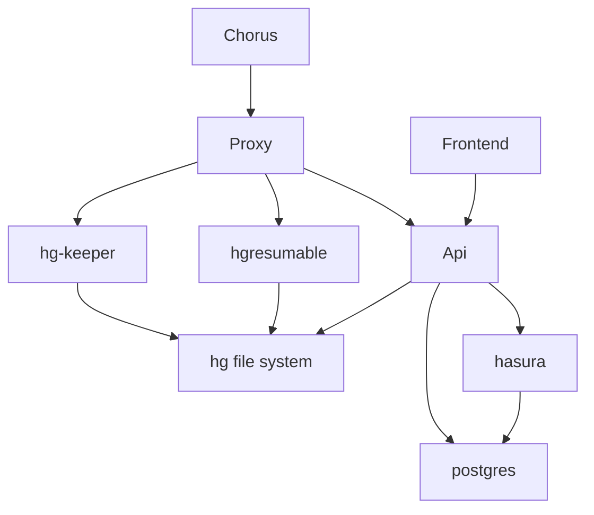
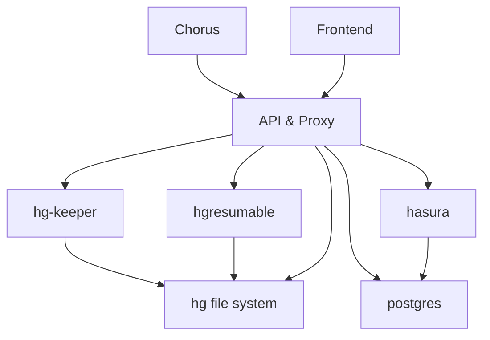

# Lexbox Language Depot replacement

## Repo Structure

* backend - contains dotnet api
* frontend - contains svelte
* hasura - contains hasura metadata

files related to a specific service should be in a folder named after the service.
There are some exceptions:
* `LexBox.sln` visual studio expects the sln to be at the root of the repo and can make things difficult otherwise

Other files, like docker-compose, should be at the root of the repo, because they're related to all services.

## Development

### Prerequisites
 * docker and docker-compose
#### for local dev also:
 * node version 18+
 * dotnet 7 sdk

#### Setup
Some environment secrets need to be setup. The .env file in the root needs to be setup.
As of writing the honeycomb api key needs to be provided, details are in the env file.
In `/frontend` copy `.env.example` to `.env`.

this project contains some seed data. The database will have that data loaded automatically.
The following users are available, password for them all is just `pass`:
* KindLion@test.com: super admin
* InnocentMoth@test.com: project manager
* PlayfulFish@test.com: project editor

There will also be a single project, Sena 3. But the repo needs to be setup, to do that execute `setup.sh` or `setup.bat`.

### Docker workflow

```bash
docker-compose up -d proxy
```

The full app will be running on http://localhost after everything starts.

### Local workflow
```bash
docker-compose up -d db hasura otel-collector maildev
```
then you will want to execute in 2 separate consoles:

frontend
```bash
cd frontend
npm run dev
```
backend
```bash
cd backend/LexBoxApi
dotnet watch
```
---
Some helpful urls:
* http://localhost:5173 - sveltekit frontend
* http://localhost:5158/api/swagger - swagger docs for the api
* http://localhost:5158/api/graphiql/ui - graphiql UI
* http://localhost:5158/api/graphiql - graphiql endpoint
* http://localhost:8088/hg - hg web UI add the project code and use the url in FLEx to clone
* http://localhost:1080 - maildev UI

#### Hasura workflow
In order to modify Hasura table relations and permissions in hasura we need to use the hasura console.
We first will need to install the hasura cli from [here](https://hasura.io/docs/latest/hasura-cli/install-hasura-cli/) and add it to your path.

Next we need to run the following command from the root of the repo:
```bash
hasura console --project hasura
```
This should open a window in the browser. You will need hasura running in docker for this to work.
Once you make some changes in the console you should notice some metadata under `hasura/metadata` has been updated, you will want to check that in to git.

##### Hasura troubleshooting

Sometimes Hasura can get out of sync with the database.
To troubleshoot this you should open the hasura console at `localhost:8081` and navigate to settings > metadata status.
If you see some errors there try reloading your metadata on the Metadata Actions tab.
It may be that dotnet did not apply migrations yet, 
so you might try restarting dotnet and wait for it to update the database schema.
Then come back and reload the metadata again.

### Proxy Diagram

Development:


Production:


More info on the frontend and backend can be found in their respective READMEs:
* [frontend](frontend/README.md)
* [backend](backend/README.md)

## Operational environment

### Staging


## Analytics

This project is instrumented with OpenTelemetry (OTEL). The exported telemetry data can be viewed in [Honeycomb](https://ui.honeycomb.io/sil-language-forge/).
