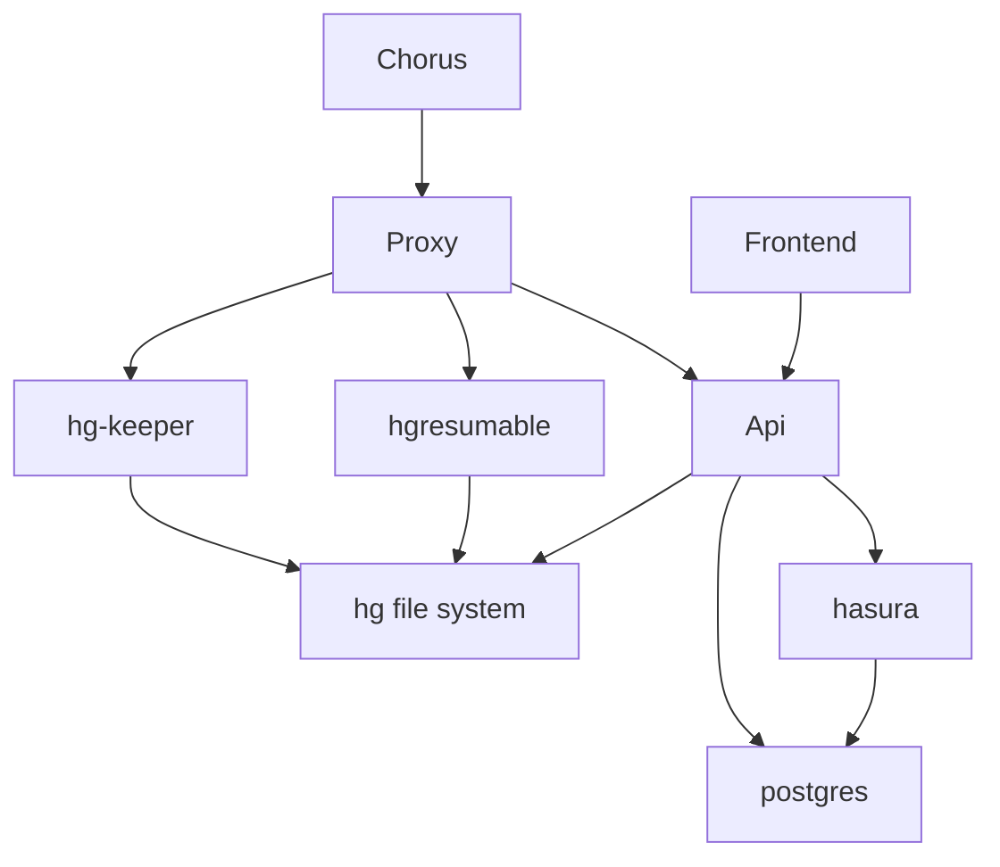
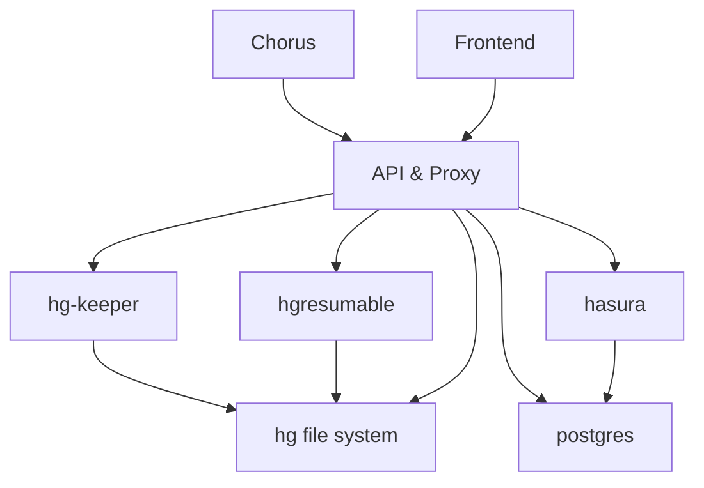
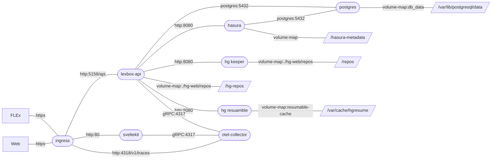

# Lexbox Language Depot replacement

## Repo Structure

* backend - contains dotnet api
* frontend - contains svelte
* hasura - contains hasura metadata

files related to a specific service should be in a folder named after the service.
There are some exceptions:
* `LexBox.sln` visual studio expects the sln to be at the root of the repo and can make things difficult otherwise

Other files, like docker-compose, should be at the root of the repo, because they're related to all services.

## Development

this project contains some seed data. The database will have that data loaded automatically.
The following users are available, password for them all is just `pass`:
* KindLion@test.com: super admin
* InnocentMoth@test.com: project manager
* PlayfulFish@test.com: project editor

There will also be a single project, Sena 3. But the repo needs to be setup, to do that execute `setup.sh` or `setup.bat`.

### Docker workflow

#### Windows

```bash
docker-compose up -d
```
#### Mac

```bash
docker-compose up -d lex-box-api
```

Try some of the helpful urls below to determine whether api is responding or not.

### Local workflow
```bash
docker-compose up -d db hasura
```
then you will want to execute in 2 separate consoles:

frontend
```bash
cd frontend
npm run dev
```
backend
```bash
cd backend/LexBoxApi
dotnet watch
```
---
Some helpful urls:
* localhost:5158/swagger - swagger docs for the api
* localhost:5158/api/graphiql/ui - graphiql UI
* localhost:5158/api/graphiql - graphiql endpoint
* localhost:8088 - hgkeeper UI add the project code and use the url in FLEx to clone

#### Hasura workflow
In order to modify Hasura table relations and permissions in hasura we need to use the hasura console.
We first will need to install the hasura cli from [here](https://hasura.io/docs/latest/hasura-cli/install-hasura-cli/) and add it to your path.

Next we need to run the following command from the root of the repo:
```bash
hasura console --project hasura
```
This should open a window in the browser. You will need hasura running in docker for this to work.
Once you make some changes in the console you should notice some metadata under `hasura/metadata` has been updated, you will want to check that in to git.

### Proxy Diagram

Development:


Production:


More info on the frontend and backend can be found in their respective READMEs:
* [frontend](frontend/README.md)
* [backend](backend/README.md)

## Operational environment

### Staging



## Analytics

This project is instrumented with OpenTelemetry (OTEL). The exported telemetry data can be viewed in [Honeycomb](https://ui.honeycomb.io/sil-language-forge/).
