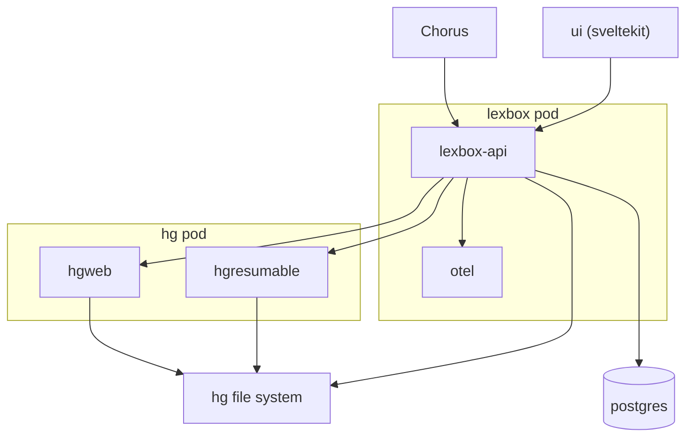
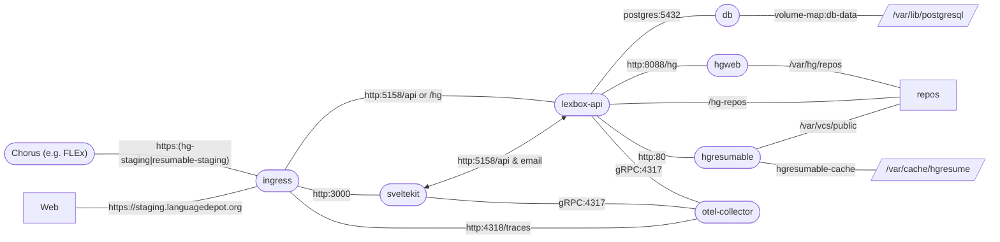

[](https://github.com/sillsdev/languageforge-lexbox/actions/workflows/lexbox-api.yaml?query=branch%3Adevelop)

# Lexbox (formerly Language Depot)

## Repo Structure

* [backend](backend/README.md) - dotnet API
* [backend/FwLite](backend/FwLite/README.md) - FieldWorks lite application
* [frontend](frontend/README.md) - SvelteKit app
* hgweb - hgweb Dockerfile and config
* otel - Open Telemetry collector config
* deployment - k8s config for production, staging, develop and local development environments

files related to a specific service should be in a folder named after the service.
There are some exceptions:
* `LexBox.sln` visual studio expects the sln to be at the root of the repo and can make things difficult otherwise

Other files, like `skaffold.yaml`, should be at the root of the repo, because they're related to all services.

## Development

### Prerequisites
 * docker and compose
   * enable Kubernetes in the Docker Desktop settings

### Setup
 * install [Taskfile](https://taskfile.dev/installation/)
   * windows: `winget install Task.Task`
   * linux: `sudo snap install task --classic` or other options on their website
   * mac: `brew install go-task/tap/go-task`
   * via npm: `npm install -g @go-task/cli`
 * install [Skaffold](https://skaffold.dev/docs/install/#standalone-binary) and add it to your path
 * clone the repo
 * run setup `task setup`, which:
   * initializes a local.env file
   * tells Git to use our ignore revs file
   * downloads the FLEx repo for the project seed data

#### Extra setup steps for Windows

If you're running Windows, you may need to add the following lines to your `C:\Windows\system32\drivers\etc\hosts` file:

```
127.0.0.1 resumable.localhost
127.0.0.1 hg.localhost
127.0.0.1 admin.localhost
```

On Linux, anything with a `.localhost` domain is automatically mapped to 127.0.0.1 so you don't need to edit your `/etc/hosts` file.

### Kubernetes workflow

```bash
task up
```
The full app will be running at http://localhost after everything starts.
There are some additional urls below to access specific parts of the system.

### Local workflow

#### Prerequisites
- The SvelteKit UI requires: node v20+
- The .NET API requires: dotnet sdk v8+

#### Running the project

There are various ways to run the project. Here are a few suggestions:

**For developing the .NET API**
- `task infra-up` starts all necessary infrastructure in k8s
- `task api:only` starts the api locally

**For developing the SvelteKit UI**
1) In two seperate consoles:
- `task backend-up` starts all necessary infrastructure + the .NET API in k8s
- `task ui:only` starts the ui locally
1) In a shared console:
- `task ui-dev`

The SvelteKit UI will be available at http://localhost:3000.

> [!IMPORTANT]
> The SvelteKit UI is always available in k8s at http://localhost, but will not be reliable unless the entire project is started with `task up`.
> 
**For developing the .NET API and the SvelteKit UI**
- `task infra-up` starts all necessary infrastructure in k8s
- `task api:only` starts the api locally
- `task ui:only` starts the ui locally

**If the k8s deployments are already running**
- `infra-forward` forwards the infrastructure ports for the API
- `backend-forward` forwards the infrastructure + backend ports for the UI

---
### Project urls
* http://localhost - k8s ingress
* http://localhost:3000 - SvelteKit UI
* http://localhost:5158/api - .NET API
* http://localhost:5158/api/swagger - .NET Swagger UI
* http://localhost:5158/api/graphql - GraphQL API
* http://localhost:5158/api/graphql/ui - GraphQL UI
* http://localhost:8088/hg - hg web UI (add the project code and use the url in FLEx to clone)
* http://localhost:1080 - maildev UI
* http://localhost:18888 - [aspire dashboard](https://learn.microsoft.com/en-us/dotnet/aspire/fundamentals/dashboard) (OTEL traces)

### Seeded data

Once the database is created by the dotnet backend, it will also seed some data in the database.
The following users are available, password for them all is just `pass`:

* admin@test.com: super admin
* manager@test.com: project manager
* editor@test.com: project editor
* user@test.com: user without any projects

There will also be a single project, Sena 3.
There will not be an hg repository however, see optional setup below if this is desired.

---
## Architecture



More info on the frontend and backend can be found in their respective READMEs:
* [frontend](frontend/README.md)
* [backend](backend/README.md)

## Operational environment

### Staging



## Monitoring & Analytics

This project is instrumented with OpenTelemetry (OTEL). The exported telemetry data can be viewed in [Honeycomb](https://ui.honeycomb.io/sil-language-forge/).

For your local environment to send traces to Honeycomb, you will need to set the `HONEYCOMB_API_KEY` environment variable in
the `deployment/local-dev/local.env` file.
You can get the key from [here](https://ui.honeycomb.io/sil-language-forge/environments/test/api_keys).

Traces can be accessed directly with a URL like this: [https://ui.honeycomb.io/sil-language-forge/environments/[test|staging|prod]/trace?trace_id=_TRACE_ID\_](https://ui.honeycomb.io/sil-language-forge/environments/test/trace?trace_id=). Yes, bookmark it!

In the application, a trace ID (aka "Error code") shown at the bottom of an error message can be Ctrl+clicked to navigate to the trace in Honeycomb.


