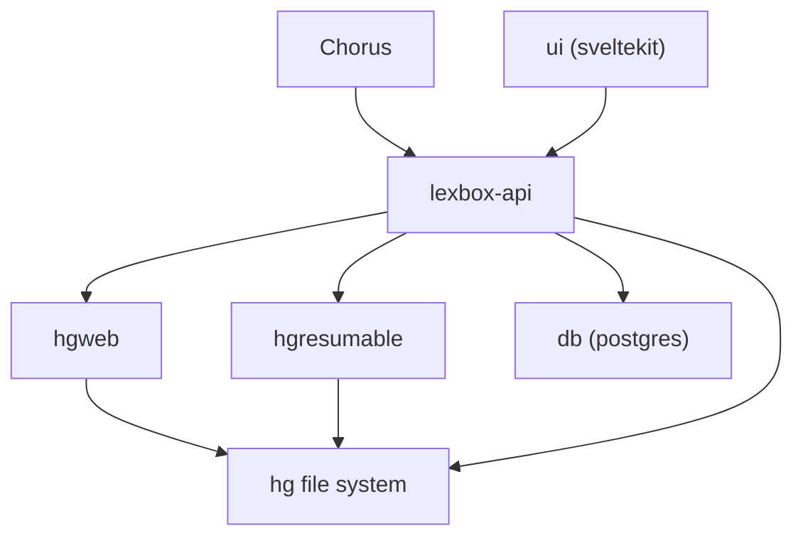
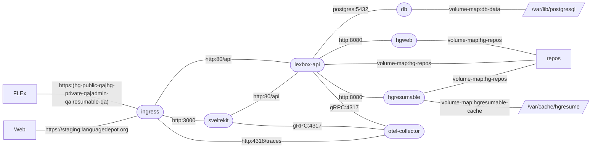

# Lexbox Language Depot replacement

## Repo Structure

* backend - contains dotnet api
* frontend - contains svelte
* hasura - contains hasura metadata
* hgweb - contains hgweb Dockerfile and config
* otel - contains open telemitry collector config
* deployment - contains k8s config for staging and prod

files related to a specific service should be in a folder named after the service.
There are some exceptions:
* `LexBox.sln` visual studio expects the sln to be at the root of the repo and can make things difficult otherwise

Other files, like `docker-compose.yaml`, should be at the root of the repo, because they're related to all services.

## Development

### Prerequisites
 * docker and compose

### Setup
 * install [Taskfile](https://taskfile.dev/installation/)
   * windows: `winget install Task.Task`
   * linux: `sudo snap install task --classic` or other options on their website
   * mac: `brew install go-task/tap/go-task`
   * via npm: `npm install -g @go-task/cli`
 * install [Skaffold](https://skaffold.dev/docs/install/#standalone-binary) add it to your path
 * run setup `task setup`

### Extra setup steps for Windows

If you're running Windows, you may need to add the following lines to your `C:\Windows\system32\drivers\etc\hosts` file:

```
127.0.0.1 resumable.localhost
127.0.0.1 hg.localhost
```

On Linux, anything with a `.localhost` domain is automatically mapped to 127.0.0.1 so you don't need to edit your `/etc/hosts` file.

### Optional setup for debugging

If you want to test out Honeycomb traces, you will need to set the `HONEYCOMB_API_KEY` environment variable in
the `deployment/dev/local.env` file.
You can get the key from [here](https://ui.honeycomb.io/sil-language-forge/environments/test/api_keys)

#### git note
this repo uses a ignore revs file. To configure this repo to use it run this command. It should be executed as part of `task setup`

```bash
git config blame.ignoreRevsFile .git-blame-ignore-revs
```

#### for local dev also:
 * node version 18+
 * dotnet 7 sdk

### Docker workflow

```bash
task up
```
The full app will be running on http://localhost after everything starts.
There are some additional urls below to access specific parts of the system.

### Local workflow
you can run the front and back end together (console output will be mixed) or in different terminals. All necessary infrastructure (`task infra`) will be started automatically.

frontend
```bash
task ui
```
backend
```bash
task api
```
both
```bash
task dev
```

pnpm should be installed automatically using nodejs corepack, if not you can run `corepack enable` to install it.

---
### Helpful urls
* http://localhost - k8s ingress
* http://localhost:3000 - sveltekit frontend
* http://localhost:5158/api/swagger - swagger docs for the api
* http://localhost:5158/api/graphql/ui - graphiql UI
* http://localhost:5158/api/graphql - graphiql endpoint
* http://localhost:8088/hg - hg web UI add the project code and use the url in FLEx to clone
* http://localhost:1080 - maildev UI

### Seeded data

Once the database is created by the dotnet backend, it will also seed some data in the database.
The following users are available, password for them all is just `pass`:

* admin@test.com: super admin
* manager@test.com: project manager
* editor@test.com: project editor
* user@test.com: user without any projects

There will also be a single project, Sena 3.
There will not be an hg repository however, see optional setup below if this is desired.

---
### Hasura workflow
In order to modify Hasura table relations and permissions in hasura we need to use the hasura console.
We first will need to install the hasura cli from [here](https://hasura.io/docs/latest/hasura-cli/install-hasura-cli/) and add it to your path.

Next we need to run the following command from the root of the repo:
```bash
hasura console --project hasura
```
This should open a window in the browser. You will need hasura running in docker for this to work.
Once you make some changes in the console you should notice some metadata under `hasura/metadata` has been updated, you will want to check that in to git.

##### Hasura troubleshooting

Sometimes Hasura can get out of sync with the database.
To troubleshoot this you should open the hasura console at `localhost:8081` and navigate to settings > metadata status.
If you see some errors there try reloading your metadata on the Metadata Actions tab.
It may be that dotnet did not apply migrations yet, 
so you might try restarting dotnet and wait for it to update the database schema.
Then come back and reload the metadata again.

---
### Diagram



More info on the frontend and backend can be found in their respective READMEs:
* [frontend](frontend/README.md)
* [backend](backend/README.md)

## Operational environment

### Staging



## Analytics

This project is instrumented with OpenTelemetry (OTEL). The exported telemetry data can be viewed in [Honeycomb](https://ui.honeycomb.io/sil-language-forge/).

Traces can be accessed directly with a URL like this: [https://ui.honeycomb.io/sil-language-forge/environments/[test|staging|prod]/trace?trace_id=_TRACE_ID\_](https://ui.honeycomb.io/sil-language-forge/environments/test/trace?trace_id=). Yes, bookmark it!

In the application, a trace ID (aka "Error code") shown at the bottom of an error message can be Ctrl+clicked to navigate to the trace in Honeycomb.


