# FwHeadless

Headless service for FieldWorks data processing. Handles Mercurial sync, FwData conversion, and SendReceive operations.

## ⚠️ CRITICAL: Data Loss Risk

**FwHeadless is where user data can be permanently lost.** This service:
- Syncs between FieldWorks (FwData) and LexBox (CRDT)
- Performs Mercurial Send/Receive operations
- Converts between data formats

**A bug here can:**
- Overwrite user edits from FieldWorks desktop
- Corrupt the Mercurial repository
- Lose data during format conversion
- Create divergent data that can't be reconciled

---

## Quick Start

```bash
# Run locally
dotnet run --project FwHeadless.csproj

# Run tests
dotnet test ../FwLite/FwLiteProjectSync.Tests
```

## Architecture


## Project Structure

| Directory | Risk Level | Purpose |
|-----------|------------|---------|
| `Services/` | 🔴 Critical | Core sync and processing services |
| `Mercurial/` | 🔴 Critical | Mercurial repository operations |
| `MercurialExtensions/` | 🟡 Medium | Custom hg extensions |
| `Controllers/` | 🟢 Low | API endpoints |
| `Routes/` | 🟢 Low | Route handlers |
| `Media/` | 🟡 Medium | Media file handling |

---

## 🔴 CRITICAL: The Sync Flow

### Full Sync Cycle

```mermaid
flowchart TD
    A[1. FieldWorks user does Send/Receive] --> B[2. FwHeadless detects Mercurial changes<br/>SyncHostedService]
    B --> C[3. Load FwData project<br/>FwDataFactory]
    C --> D[4. Sync FwData → CRDT<br/>CrdtFwdataProjectSyncService]
    D --> E[5. Sync CRDT → LexBox server<br/>CrdtSyncService]
    E --> F[6. Later: Sync LexBox → CRDT → FwData → Mercurial]
    F --> G[7. FieldWorks user gets changes on next S/R]
    
    style D fill:#f99,stroke:#333
    style E fill:#f99,stroke:#333
```



**Critical steps highlighted** - Steps 4 and 5 are where data loss can occur.

### Key Services

| Service | Purpose | Danger Level |
|---------|---------|--------------|
| `CrdtSyncService` | Syncs Harmony CRDT with LexBox server | 🔴 High |
| `SendReceiveService` | Mercurial clone/push/pull | 🔴 High |
| `CrdtFwdataProjectSyncService` | FwData ↔ CRDT bidirectional sync | 🔴 **HIGHEST** |
| `SyncHostedService` | Background job orchestrator | 🟡 Medium |
| `ProjectLookupService` | Finds/validates projects | 🟢 Low |

---

## 🔴 CRITICAL FILE: `Services/CrdtSyncService.cs`

This is surprisingly simple - it just calls `dataModel.SyncWith()`:

```csharp
public async Task SyncHarmonyProject()
{
    var lexboxRemoteServer = await httpSyncService.CreateProjectSyncable(...);
    var syncResults = await dataModel.SyncWith(lexboxRemoteServer);
    if (!syncResults.IsSynced) throw new InvalidOperationException("Sync failed");
}
```

**But if this fails silently, users lose data.** Always check:
- `syncResults.IsSynced` 
- `syncResults.MissingFromLocal` / `MissingFromRemote`
- Network errors in logs

---

## 🔴 CRITICAL FILE: `Services/SendReceiveService.cs`

Wraps Mercurial operations via `SendReceiveHelpers`:

```csharp
public async Task<LfMergeBridgeResult> SendReceive(FwDataProject project, string? projectCode, ...)
public async Task<LfMergeBridgeResult> Clone(FwDataProject project, string? projectCode)
public async Task<int> PendingCommitCount(FwDataProject project, string? projectCode)
```

### Landmines 🚨

1. **Stuck Mercurial locks**
   - Check `Mercurial/` for `.hg/wlock` or `.hg/lock` files
   - Can cause all S/R operations to hang

2. **FdoDataModelVersion mismatch**
   - FwHeadless must match FieldWorks version
   - See `FwHeadlessConfig.FdoDataModelVersion`
   - Wrong version = corrupted data

3. **Auth failures are silent**
   - Check `HttpClientAuthHandler.cs` for token issues
   - Logs may not clearly indicate auth problems

---

## 🔴 The Real Complexity is in FwLite

Most of the dangerous sync logic lives in `backend/FwLite/FwLiteProjectSync/`:
- `CrdtFwdataProjectSyncService.cs` - The actual sync algorithm
- See `backend/FwLite/AGENTS.md` for detailed documentation

FwHeadless is mainly orchestration; the sync logic is shared with FwLite.

---

## Configuration

### Key Config Options (`FwHeadlessConfig.cs`)

```csharp
public class FwHeadlessConfig
{
    public string HgWebUrl { get; set; }           // Mercurial server URL
    public string FdoDataModelVersion { get; set; } // Must match FW version!
    // Auth settings for LexBox API
}
```

### Environment Settings

- `appsettings.json` - Base configuration
- `appsettings.Development.json` - Local dev overrides

---

## Common Issues & Solutions

### "Sync stuck / not running"

1. Check `SyncHostedService` logs
2. Look for Mercurial lock files
3. Verify LexBox server is reachable
4. Check project exists in database

### "Data not appearing in FieldWorks"

1. Is CRDT → FwData sync working? Check logs for `CrdtFwdataProjectSyncService`
2. Is Mercurial commit happening? Check `SendReceiveService` logs
3. Did FW user do Send/Receive?

### "Data not appearing in LexBox"

1. Is FwData → CRDT sync working? Check logs
2. Is CRDT → LexBox sync working? Check `CrdtSyncService` logs
3. Check for auth errors in `HttpClientAuthHandler`

### "Mercurial errors"

1. Check for lock files in `.hg/`
2. Verify `HgWebUrl` is correct
3. Check auth credentials
4. Look at Mercurial extension logs

---

## Testing

### Unit Tests

FwHeadless doesn't have many direct tests. The sync logic is tested in:

```bash
dotnet test ../FwLite/FwLiteProjectSync.Tests
```

### Integration Testing

1. Set up local Mercurial server (see `hgweb/`)
2. Create test FwData project
3. Run FwHeadless against it
4. Verify sync in both directions

### Key Test Files

- `FwLiteProjectSync.Tests/Sena3SyncTests.cs` - Uses real FwData
- `FwLiteProjectSync.Tests/SyncTests.cs` - Sync algorithm tests

---

## Important Files

| File | Purpose |
|------|---------|
| `Program.cs` | Entry point, sets up DI |
| `FwHeadlessKernel.cs` | Service registration |
| `FwHeadlessConfig.cs` | Configuration model |
| `Services/CrdtSyncService.cs` | CRDT ↔ LexBox sync |
| `Services/SendReceiveService.cs` | Mercurial operations |
| `Services/SyncHostedService.cs` | Background job runner |
| `HttpClientAuthHandler.cs` | Auth for LexBox API |
| `LexboxFwDataMediaAdapter.cs` | Media file handling |

---

## Debugging Tips

1. **Enable detailed logging** in `appsettings.Development.json`
2. **Use `DryRunMiniLcmApi`** to see what sync would do without applying
3. **Check ProjectSnapshot** - if it's wrong, sync will be wrong
4. **Compare CRDT and FwData states** manually when debugging
5. **Mercurial log** (`hg log -v`) shows commit history

---

## Getting Help

- Most sync logic documentation is in `backend/FwLite/AGENTS.md`
- Study `Sena3SyncTests.cs` for real-world sync scenarios
- When in doubt, add logging and trace through the sync flow
