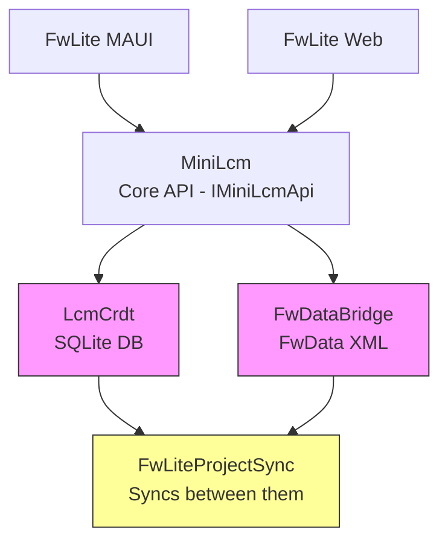
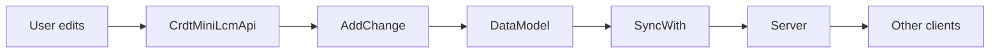

# FwLite (FieldWorks Lite)

Lightweight FieldWorks application for dictionary editing with CRDT-based sync.

## ⚠️ CRITICAL: This is High-Risk Code

**This area contains the most critical and challenging code in the repository.** Changes here can cause:
- **Data loss** in FwData (FieldWorks) projects
- **Sync corruption** between CRDT and FwData
- **Silent failures** that users won't notice until data is lost

**Before making changes:**
1. Read the relevant section below thoroughly
2. Understand the sync flow end-to-end
3. Run the full test suite: `dotnet test FwLiteOnly.slnf`
4. Test with real FwData projects, not just unit tests

---

## Quick Start

```bash
# Run FwLite Web (typical workflow)
task fw-lite-web   # from repo root

# Run tests (ALWAYS run before committing)
dotnet test FwLiteOnly.slnf

# Build MAUI app (Windows)
dotnet build FwLiteMaui/FwLiteMaui.csproj --framework net9.0-windows10.0.19041.0
```

## Generated Types (TypeScript)

The frontend viewer uses TypeScript types and API interfaces generated from .NET using **Reinforced.Typings**. These are automatically updated when you build the **FwLiteShared** project (or any project that depends on it like `FwLiteMaui` or `FwLiteWeb`).

```bash
# To manually update generated types:
dotnet build backend/FwLite/FwLiteShared/FwLiteShared.csproj
```

The configuration for this lives in `FwLiteShared/TypeGen/ReinforcedFwLiteTypingConfig.cs` and `FwLiteShared/Reinforced.Typings.settings.xml`.

## Project Structure

| Directory | Priority | Purpose |
|-----------|----------|---------|
| `MiniLcm/` | 🔴 Critical | Core dictionary API - entries, senses, definitions. Model decisions here affect everything. |
| `LcmCrdt/` | 🔴 Critical | CRDT implementation for sync. Performance bottlenecks live here. |
| `FwDataMiniLcmBridge/` | 🔴 Critical | Bridge to FieldWorks. **Data loss risk if bugs here.** |
| `FwLiteProjectSync/` | 🔴 Critical | Sync logic between CRDT and FwData. **Most complex code.** |
| `FwLiteMaui/` | 🟡 Medium | .NET MAUI desktop/mobile app |
| `FwLiteWeb/` | 🟡 Medium | ASP.NET Core web host |
| `FwLiteShared/` | 🟢 Low | Shared utilities |

## Architecture



**Note:** Two implementations of `IMiniLcmApi` exist - LcmCrdt (SQLite) and FwDataBridge (FwData XML). FwLiteProjectSync syncs between them.

---

## 🔴 CRITICAL AREA: Adding Features to MiniLcm Model

When adding a new field/property to the model (Entry, Sense, etc.):

### Step-by-Step Checklist

1. **Add to `MiniLcm/Models/`** - The core model class
   - Add property with appropriate type
   - Add to `Copy()` method
   - Add to `GetReferences()` if it references another entity
   - Add to `RemoveReference()` if it can be orphaned

2. **Add to `LcmCrdt/Objects/`** - The CRDT entity mirror
   - Mirror the property exactly
   - Add to entity configuration in `LcmCrdtDbContext.cs`

3. **Create Change class in `LcmCrdt/Changes/`**
   - For new fields: use `JsonPatchChange<T>` (simplest)
   - For complex operations: create dedicated change class
   - **MUST** register in `LcmCrdtKernel.cs` → `ConfigureCrdt()`

4. **Update `CrdtMiniLcmApi.cs`**
   - Implement read/write for the new field
   - Consider: does this need a new API method?

5. **Update `FwDataMiniLcmBridge/Api/FwDataMiniLcmApi.cs`**
   - Map to/from LCM (FieldWorks) data structures
   - This is ~1700 lines - search for similar fields

6. **Update Sync helpers in `MiniLcm/SyncHelpers/`**
   - Add diff logic for the new field
   - **CRITICAL**: sync bugs here cause data loss

7. **Add tests**:
   - `MiniLcm.Tests/` - Base test class for API behavior
   - `LcmCrdt.Tests/` - CRDT-specific tests
   - `FwLiteProjectSync.Tests/` - Sync round-trip tests

### ⚠️ Performance Warning

CRDT change classes can cause **multiple database hits per change**. If adding complex operations:
- Profile with realistic data (1000+ entries)
- Consider batching in `AddChanges()` instead of `AddChange()`
- Check `LcmCrdt/QueryHelpers.cs` for optimization patterns

---

## 🔴 CRITICAL AREA: CRDT Sync

### Known Issue: Auto-Download Stops

The app can enter a state where it stops automatically downloading changes from other users. This is a P1 bug (see issue lb-8mg). If you discover the cause, file an issue immediately.

### Key Files for Sync

- `LcmCrdt/RemoteSync/` - Server communication
- `LcmCrdt/Data/DataModel.cs` - Core CRDT operations (from SIL.Harmony)
- `FwLiteProjectSync/CrdtFwdataProjectSyncService.cs` - CRDT ↔ FwData sync

### Sync Flow



### Testing Sync

1. **Unit tests**: `dotnet test LcmCrdt.Tests`
2. **Integration tests**: `dotnet test FwLiteProjectSync.Tests`
3. **Manual testing**: Use two browser windows, edit in both, verify sync

---

## 🔴 CRITICAL AREA: FwData ↔ CRDT Sync

**This is where data loss happens.** The sync between CRDT (SQLite) and FwData (FieldWorks XML) is the most complex code.

### Key File: `FwLiteProjectSync/CrdtFwdataProjectSyncService.cs`

This orchestrates the bidirectional sync:

```csharp
// Simplified flow:
1. Get FwData current state
2. Get CRDT current state  
3. Get ProjectSnapshot (last known synced state)
4. Diff: FwData vs Snapshot → changes to apply to CRDT
5. Diff: CRDT vs FwData → changes to apply to FwData
6. Apply changes to both sides
7. Save new ProjectSnapshot
```

### Landmines 🚨

1. **ProjectSnapshot must be regenerated from CRDT after sync**
   - See comment about issue #1912 in the code
   - If snapshot is generated from wrong source, future syncs will be wrong

2. **Order of sync operations matters**
   - WritingSystems → Publications → PartsOfSpeech → SemanticDomains → ComplexFormTypes → Entries
   - Entries depend on the others; sync them last

3. **Complex forms sync is two-phase**
   - `SyncWithoutComplexFormsAndComponents` first
   - `SyncComplexFormsAndComponents` second
   - Because complex forms reference entries that may not exist yet

4. **FwData save is explicit**
   - `fwdataApi.Save()` must be called after changes
   - Missing this = data loss

### Testing Sync

The gold standard is `FwLiteProjectSync.Tests/Sena3SyncTests.cs` which uses a real FwData project.

```bash
dotnet test FwLiteProjectSync.Tests --filter "Sena3"
```

---

## Adding a New Harmony Change

### Step-by-Step

1. Create change class in `LcmCrdt/Changes/`
   - Extend `CreateChange<T>` or `EditChange<T>`
   - See `CreateComplexFormType.cs` for create example
   - See `JsonPatchChange.cs` for simple field updates

2. Register in `LcmCrdt/LcmCrdtKernel.cs` → `ConfigureCrdt()`
   ```csharp
   config.AddChangeEntity<MyNewChange>()
   ```

3. Add test in `LcmCrdt.Tests/Changes/UseChangesTests.cs`

### ⚠️ JSON Serialization Rules

Constructor parameter names **must match** property names (camelCase → PascalCase):

```csharp
// ❌ Wrong - userName doesn't match Name
public MyChange(string userName) { Name = userName; }

// ✅ Correct - name matches Name  
public MyChange(string name) { Name = name; }
```

### ⚠️ Handle Deleted References

Changes may reference deleted objects (due to sync timing). Always check:

```csharp
if (entity?.DeletedAt is not null) return;
```

---

## Important Files Quick Reference

| File | Purpose | Risk Level |
|------|---------|------------|
| `MiniLcm/IMiniLcmApi.cs` | Core API interface | 🔴 High |
| `MiniLcm/Models/Entry.cs` | Entry model | 🔴 High |
| `MiniLcm/SyncHelpers/EntrySync.cs` | Entry diff/sync | 🔴 High |
| `LcmCrdt/CrdtMiniLcmApi.cs` | CRDT implementation | 🔴 High |
| `LcmCrdt/LcmCrdtKernel.cs` | CRDT registration | 🟡 Medium |
| `FwDataMiniLcmBridge/Api/FwDataMiniLcmApi.cs` | FwData bridge | 🔴 High |
| `FwLiteProjectSync/CrdtFwdataProjectSyncService.cs` | Sync orchestration | 🔴 High |

---

## Testing Strategy

### Before ANY commit:

```bash
# Run all FwLite tests
dotnet test FwLiteOnly.slnf

# If touching sync code, also run:
dotnet test FwLiteProjectSync.Tests
```

### Test Categories

| Area | Test Project | Key Tests |
|------|--------------|-----------|
| Model behavior | `MiniLcm.Tests` | `*TestsBase.cs` classes |
| CRDT changes | `LcmCrdt.Tests` | `Changes/UseChangesTests.cs` |
| Sync logic | `FwLiteProjectSync.Tests` | `SyncTests.cs`, `Sena3SyncTests.cs` |
| Round-trip | `FwLiteProjectSync.Tests` | `EntrySyncTests.cs` |

### Writing New Tests

For model additions, add to the `*TestsBase.cs` pattern:
- Base class in `MiniLcm.Tests/`
- Implementations in both `LcmCrdt.Tests/MiniLcmTests/` and `FwDataMiniLcmBridge.Tests/`
- This ensures both implementations behave the same

---

## Common Tasks

### "Add a new field to Entry"

1. `MiniLcm/Models/Entry.cs` - add property
2. `MiniLcm/Models/Entry.cs` - add to `Copy()`
3. `LcmCrdt/Objects/Entry.cs` - mirror property
4. `MiniLcm/SyncHelpers/EntrySync.cs` - add to `EntryDiffToUpdate()`
5. `FwDataMiniLcmBridge/Api/FwDataMiniLcmApi.cs` - map to/from LCM
6. Tests in all three test projects

### "Add a new entity type (like Sense, ExampleSentence)"

This is major work. Follow the pattern of `Sense`:
1. Model in `MiniLcm/Models/`
2. CRDT entity in `LcmCrdt/Objects/`
3. Create/Update changes in `LcmCrdt/Changes/`
4. API methods in interfaces and both implementations
5. Sync helper in `MiniLcm/SyncHelpers/`
6. Full test coverage

### "Fix a sync bug"

1. Reproduce with a test in `FwLiteProjectSync.Tests/`
2. Use `DryRunMiniLcmApi` to see what changes would be made
3. Debug through `CrdtFwdataProjectSyncService.Sync()`
4. Check `ProjectSnapshot` handling

---

## Getting Help

- Existing sync tests are the best documentation
- `Sena3SyncTests.cs` uses real FwData - study it
- When in doubt, add more logging and test with real data
