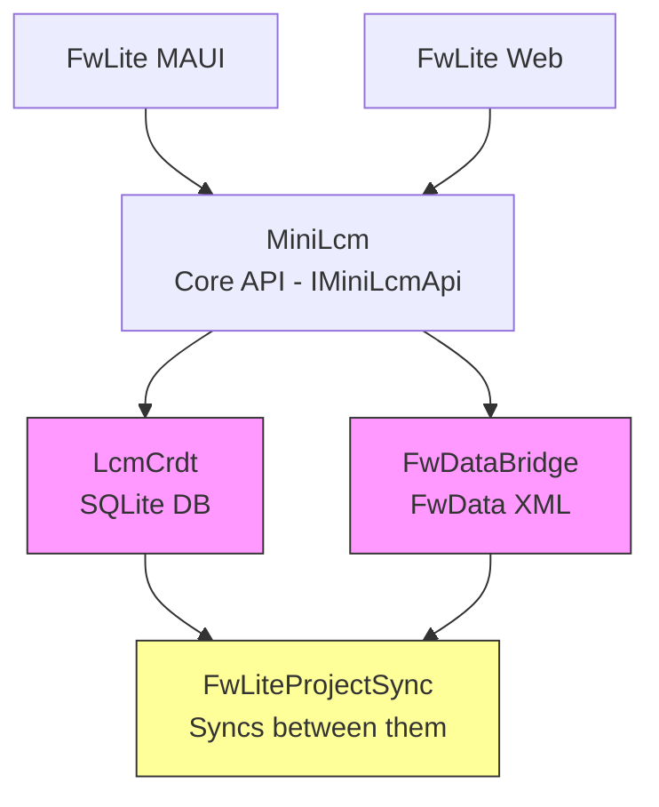
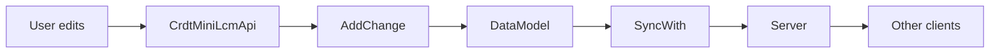

# FwLite (FieldWorks Lite)

Lightweight FieldWorks application for dictionary editing with CRDT-based sync.

## ⚠️ CRITICAL: This is High-Risk Code

**This area contains the most critical and challenging code in the repository.** Changes here can cause:
- **Data loss** in FwData (FieldWorks) projects
- **Sync corruption** between CRDT and FwData
- **Silent failures** that users won't notice until data is lost

**Before making changes:**
1. Read the relevant section below thoroughly
2. Understand the sync flow end-to-end
3. Identify which tests cover the affected area (run a targeted selection when the work is done — see the root `AGENTS.md` Testing section)
4. Test with real FwData projects, not just unit tests

---

## Quick Start

```bash
# Run FwLite Web (typical workflow)
task fw-lite-web   # from repo root

# Fast inner loop: FwLiteShared builds in seconds and regenerates the viewer's TS types
dotnet build backend/FwLite/FwLiteShared/FwLiteShared.csproj
# One MAUI head (~40 s Windows, ~80 s Android). BuildAndroid=false skips restoring the Android TFM.
dotnet build backend/FwLite/FwLiteMaui/FwLiteMaui.csproj -f net10.0-windows10.0.19041.0 -p:BuildAndroid=false -clp:ErrorsOnly
dotnet build backend/FwLite/FwLiteMaui/FwLiteMaui.csproj -f net10.0-android -clp:ErrorsOnly
```

Batch edits before a head build. `dotnet build` takes one project: build the csproj, never the folder.

### Test timings

Observed in agent sessions; plan around them.

| Run | Minutes |
|---|---|
| `LcmCrdt.Tests` whole project (~720 tests) | 4 to 9 |
| `Sena3SyncTests` (any `Sena3` filter) | 9 to 20 |
| `BulkCreateEntriesTest.BulkCreateEntriesPerformance` | ~3.5 |
| One test class, already built, `--no-build` | under 1 |

- Build the test csproj once, then `dotnet test <csproj> --no-build --filter ...` per iteration.
- Anything over 2 minutes goes in `run_in_background`; tell the user it is running.
- `Console.Error` is swallowed under xUnit. Log through `ITestOutputHelper`, or add `--logger "console;verbosity=detailed"`.

### Logs & diagnostics

| App | Log |
|---|---|
| MAUI Windows, MSIX-installed | `%LOCALAPPDATA%\Packages\<PFN>\LocalState\app.log` (+ `app1.log`) |
| MAUI Windows, Debug or portable (unpackaged) | `app.log` in the working directory, or next to the exe when launched from System32 |
| Any MAUI | override the folder with env `FwLiteMaui__BaseDataDir` (`FwLiteMauiConfig.cs`) |
| FwLiteWeb | `./fw-lite-web.log` in its working directory (`FwLiteWeb:LogFileName`) |
| Android | `adb logcat -d -t 200 \| grep DOTNET` (console logging lands under the `DOTNET` tag) |

## Testing on Android (agents)

No emulator running? Start one yourself — don't ask. `emulator -list-avds` (try `$ANDROID_HOME/emulator/`, `$LOCALAPPDATA/Android/Sdk/emulator/`, etc.) → pick an `fwlite_*` image → launch in background with `-no-snapshot-load -no-boot-anim` → wait until `adb -e get-state` is `device` and `sys.boot_completed` is `1` → `task android-emulator-dev`. Physical device fallback: `task android-dev`. Drive UI with `adb -e shell input tap/swipe` + `adb -e exec-out screencap -p > path.png`.

## Generated Types (TypeScript)

The frontend viewer uses TypeScript types and API interfaces generated from .NET using **Reinforced.Typings**. These are automatically updated when you build the **FwLiteShared** project (or any project that depends on it like `FwLiteMaui` or `FwLiteWeb`).

```bash
# To manually update generated types:
dotnet build backend/FwLite/FwLiteShared/FwLiteShared.csproj

# Verify types are committed (also runs in CI):
task fw-lite:has-stale-generated-types
```

The configuration for this lives in `FwLiteShared/TypeGen/ReinforcedFwLiteTypingConfig.cs` and `FwLiteShared/Reinforced.Typings.settings.xml`. The `index.ts` barrels under `generated-types/` are hand-maintained: add an export when you add an event or service. A new `[JSInvokable]` method on `MiniLcmJsInvokable` also needs a stub in `frontend/viewer/src/project/demo/in-memory-demo-api.ts`, or svelte-check fails late.

⚠️ **`[JSInvokable]` methods must not have optional/defaulted parameters (nor a `CancellationToken`).** The generated TS marks them optional (`arg?`), but that's a lie: Blazor JSInterop requires JS to pass every parameter, and can't marshal a `CancellationToken` — so JS callers break at runtime. If a server-side (REST) caller needs cancellation or an extra arg, add a separate **non-`[JSInvokable]`** overload for it (see `AuthService.SignInWebView`).

## Project Structure

| Directory | Priority | Purpose |
|-----------|----------|---------|
| `MiniLcm/` | 🔴 Critical | Core dictionary API - entries, senses, definitions. Model decisions here affect everything. |
| `LcmCrdt/` | 🔴 Critical | CRDT implementation for sync. Performance bottlenecks live here. |
| `FwDataMiniLcmBridge/` | 🔴 Critical | Bridge to FieldWorks. **Data loss risk if bugs here.** |
| `FwLiteProjectSync/` | 🔴 Critical | Sync logic between CRDT and FwData. **Most complex code.** |
| `FwLiteMaui/` | 🟡 Medium | .NET MAUI desktop/mobile app |
| `FwLiteWeb/` | 🟡 Medium | ASP.NET Core web host |
| `FwLiteShared/` | 🟢 Low | Shared utilities |

## Architecture


```mermaid
flowchart TD
    MAUI[FwLite MAUI] --> ML[MiniLcm<br/>Core API - IMiniLcmApi]
    WEB[FwLite Web] --> ML
    
    ML --> CRDT[LcmCrdt<br/>SQLite DB]
    ML --> BRIDGE[FwDataBridge<br/>FwData XML]
    
    CRDT --> SYNC[FwLiteProjectSync<br/>Syncs between them]
    BRIDGE --> SYNC
    
    style CRDT fill:#f9f,stroke:#333
    style BRIDGE fill:#f9f,stroke:#333
    style SYNC fill:#ff9,stroke:#333
```

**Note:** Two implementations of `IMiniLcmApi` exist - LcmCrdt (SQLite) and FwDataBridge (FwData XML). FwLiteProjectSync syncs between them.

---

## 🔴 CRITICAL AREA: Adding Features to MiniLcm Model

When adding a new field/property to the model (Entry, Sense, etc.):

### Step-by-Step Checklist

1. **Add to `MiniLcm/Models/`** - The core model class
   - Add property with appropriate type
   - Add to `Copy()` method
   - Add to `GetReferences()` if it references another entity
   - Add to `RemoveReference()` if it can be orphaned

2. **Add to `LcmCrdt/Objects/`** - The CRDT entity mirror
   - Mirror the property exactly
   - Add to entity configuration in `LcmCrdtDbContext.cs`

3. **Create Change class in `LcmCrdt/Changes/`**
   - For new fields: use `JsonPatchChange<T>` (simplest)
   - For complex operations: create dedicated change class
   - **MUST** register in `LcmCrdtKernel.cs` → `ConfigureCrdt()`

4. **Update `CrdtMiniLcmApi.cs`**
   - Implement read/write for the new field
   - Consider: does this need a new API method?

5. **Update `FwDataMiniLcmBridge/Api/FwDataMiniLcmApi.cs`**
   - Map to/from LCM (FieldWorks) data structures
   - This is ~1700 lines - search for similar fields

6. **Update Sync helpers in `MiniLcm/SyncHelpers/`**
   - Add diff logic for the new field
   - **CRITICAL**: sync bugs here cause data loss

7. **Add tests**:
   - `MiniLcm.Tests/` - Base test class for API behavior
   - `LcmCrdt.Tests/` - CRDT-specific tests
   - `FwLiteProjectSync.Tests/` - Sync round-trip tests

### ⚠️ Performance Warning

CRDT change classes can cause **multiple database hits per change**. If adding complex operations:
- Profile with realistic data (1000+ entries)
- Consider batching in `AddChanges()` instead of `AddChange()`
- Check `LcmCrdt/QueryHelpers.cs` for optimization patterns

---

## 🔴 CRITICAL AREA: CRDT Sync

### Known Issue: Auto-Download Stops

The app can enter a state where it stops automatically downloading changes from other users. This is a P1 bug (see issue lb-8mg). If you discover the cause, file an issue immediately.

### Key Files for Sync

- `LcmCrdt/RemoteSync/` - Server communication
- `LcmCrdt/Data/DataModel.cs` - Core CRDT operations (from SIL.Harmony)
- `FwLiteProjectSync/CrdtFwdataProjectSyncService.cs` - CRDT ↔ FwData sync

### Sync Flow


```mermaid
flowchart LR
    USER[User edits] --> CRDT[CrdtMiniLcmApi]
    CRDT --> ADD[AddChange]
    ADD --> DM[DataModel]
    DM --> SYNC[SyncWith]
    SYNC --> SERVER[Server]
    SERVER --> CLIENTS[Other clients]
```

---

## 🔴 CRITICAL AREA: FwData ↔ CRDT Sync

**This is where data loss happens.** The sync between CRDT (SQLite) and FwData (FieldWorks XML) is the most complex code.

### Key File: `FwLiteProjectSync/CrdtFwdataProjectSyncService.cs`

This orchestrates the bidirectional sync:

```csharp
// Simplified flow:
1. Get FwData current state
2. Get CRDT current state  
3. Get ProjectSnapshot (last known synced state)
4. Diff: FwData vs Snapshot → changes to apply to CRDT
5. Diff: CRDT vs FwData → changes to apply to FwData
6. Apply changes to both sides
7. Save new ProjectSnapshot
```

### Landmines 🚨

1. **ProjectSnapshot must be regenerated from CRDT after sync**
   - See comment about issue #1912 in the code
   - If snapshot is generated from wrong source, future syncs will be wrong

2. **Order of sync operations matters**
   - WritingSystems → Publications → PartsOfSpeech → SemanticDomains → ComplexFormTypes → Entries
   - Entries depend on the others; sync them last

3. **Complex forms sync is two-phase**
   - `SyncWithoutComplexFormsAndComponents` first
   - `SyncComplexFormsAndComponents` second
   - Because complex forms reference entries that may not exist yet

4. **FwData save is explicit**
   - `fwdataApi.Save()` must be called after changes
   - Missing this = data loss

### Concurrency model: CRDT forgives, FwData doesn't

Sync applies a diff of the stale last-synced snapshot vs current FwData onto CRDT, but a diff of live FwData vs live CRDT onto FwData. So a change reaching CRDT can be invalid (another client deleted or reparented its target since the snapshot), while a change reaching FwData is never stale. That's the point of a CRDT: it merges conflicting intent (delete-wins, etc.); FwData has no conflict resolution and must not fake one.

Hence the `Submit*` write variants. Sync calls a `Submit*` where the plain method would throw on a concurrency-produced state — a `Create*`/`Update*` that reads back a deleted target, or a guard like `MoveExampleSentence`'s target-sense check. On CRDT the `Submit*` drops that and records the intent (delete-wins resolves it); on FwData it forwards to the strict method. Where the plain method is already tolerant (deletes), sync calls it directly — no variant.

So: add a `Submit*` only when the plain path throws on concurrency, route sync through it, keep the plain method strict. Never fix a sync wedge by weakening a strict method or making FwData forgiving.

### Testing Sync

The gold standard is `FwLiteProjectSync.Tests/Sena3SyncTests.cs` which uses a real FwData project (9 to 20 min: run it in the background, once, when the work is done).

```bash
dotnet test backend/FwLite/FwLiteProjectSync.Tests/FwLiteProjectSync.Tests.csproj --filter "FullyQualifiedName~Sena3"
```

To debug a sync bug: reproduce it in `FwLiteProjectSync.Tests/`, then run a dry-run sync (`SyncDryRun`/`ImportDryRun`, recorded via `RecordingMiniLcmApi`) to see the changes it would make before stepping through `CrdtFwdataProjectSyncService.Sync()`.

---

## Adding a New Harmony Change

### Step-by-Step

1. Create change class in `LcmCrdt/Changes/`
   - Extend `CreateChange<T>` or `EditChange<T>`
   - See `CreateComplexFormType.cs` for create example
   - See `JsonPatchChange.cs` for simple field updates

2. Register in `LcmCrdt/LcmCrdtKernel.cs` → `ConfigureCrdt()`
   ```csharp
   config.AddChangeEntity<MyNewChange>()
   ```

3. Add test in `LcmCrdt.Tests/Changes/UseChangesTests.cs`

### ⚠️ JSON Serialization Rules

Constructor parameter names **must match** property names (camelCase → PascalCase):

```csharp
// ❌ Wrong - userName doesn't match Name
public MyChange(string userName) { Name = userName; }

// ✅ Correct - name matches Name  
public MyChange(string name) { Name = name; }
```

### ⚠️ Handle Deleted References

Changes may reference deleted objects (due to sync timing). Always check:

```csharp
if (entity?.DeletedAt is not null) return;
```

---

## 🚨 linq2db and timestamps

linq2db wraps every SQLite timestamp comparison in `strftime('...%f', ...)` — millisecond precision, not configurable. Never filter or compare commit timestamps through `ToLinqToDB()`; use EF for those predicates (full-precision TEXT comparison, like Harmony's own `CrdtRepository`). `OrderBy` on a timestamp column is safe. See `SnapshotAtCommitService.DeleteCommitsAfter`.

## 🚨 Harmony Projected Tables (`LcmCrdtDbContext`)

`LcmCrdtDbContext` DbSets (`Entries`, `Senses`, etc.) are Harmony's **projected snapshot tables**. They contain only the latest, **un-deleted** state.

- ❌ **Do NOT** add `DeletedAt is null` filters when querying these DbSets — soft-deleted rows are never present. The `DeletedAt` column exists on the entity types (it's used inside Change classes during change application — see above), but the projection drops deleted rows entirely, so filtering on it is dead code that misleads readers.
- ✅ If you need deleted history, query the change/commit tables directly (see `HistoryService.cs`, `SnapshotAtCommitService.cs`).

---

## Validation

Imperative validation in `MiniLcmApiValidationWrapper` (rules that need an async lookup, so they can't be FluentValidation rules) must throw `FluentValidation.ValidationException` — the same type the validators throw — not `InvalidOperationException`. Otherwise the same rule reports different exception types per code path. Reserve `InvalidOperationException` for genuine "can't happen" data-integrity guards, not user-input validation.

---

## Testing Strategy

### When the work is finished:

Run a targeted selection of the tests covering what you changed (root `AGENTS.md` → Testing). For 🔴 critical sync changes that usually includes the relevant `FwLiteProjectSync.Tests` scenarios. `dotnet test FwLiteOnly.slnf` runs everything but is slow — reserve it for when broad signal is genuinely needed.

### Test Categories

| Area | Test Project | Key Tests |
|------|--------------|-----------|
| Model behavior | `MiniLcm.Tests` | `*TestsBase.cs` classes |
| CRDT changes | `LcmCrdt.Tests` | `Changes/UseChangesTests.cs` |
| Sync logic | `FwLiteProjectSync.Tests` | `SyncTests.cs`, `Sena3SyncTests.cs` |
| Round-trip | `FwLiteProjectSync.Tests` | `EntrySyncTests.cs` |

### Writing New Tests

For model additions, add to the `*TestsBase.cs` pattern:
- Base class in `MiniLcm.Tests/`
- Implementations in both `LcmCrdt.Tests/MiniLcmTests/` and `FwDataMiniLcmBridge.Tests/`
- This ensures both implementations behave the same

### Verify snapshots

Tests tagged `Category=Verified` (`task fw-lite:test-verified`) compare against committed `*.verified.*` fixtures and write a `*.received.*` sibling on mismatch. `task fw-lite:accept-snapshots` lists every received file with a diff stat; `-- --apply` promotes them. Review the diff first: a changed fixture is a format change shipped to users.

| Fixture | Regenerated by |
|---|---|
| `LcmCrdt.Tests/Data/MigrationTests_FromScriptedDb.{v1,v2}.*` | `MigrationTests.VerifyAfterMigrationFromScriptedDb` |
| `LcmCrdt.Tests/{Changes/Change,Data/Snapshot}DeserializationRegressionData.{latest,legacy}` | `RegressionDataUpToDate` in `ChangeSerializationTests` / `SnapshotDeserializationTests` |
| `LcmCrdt.Tests/DataModelSnapshotTests.VerifyDbModel` (+ 3 siblings) | `DataModelSnapshotTests` |
| `FwLiteProjectSync.Tests/sena-3-live.verified.sqlite` + `sena-3-live_snapshot` | `Sena3SyncTests.LiveSena3Sync` (writes `sena-3-live.received.sqlite` when CRDT changes) |

`sena-3-live.verified.sqlite` stores applied migration ids in `__EFMigrationsHistory`. When it already records a migration, keep that migration's id and patch the fixture; renaming or re-adding the migration breaks the fixture.

## Further reading

- `FwLiteMaui/Platforms/README.md`: verified Windows (MSIX, restart) and Android (Play in-app update) API gotchas.
- `docs/research/msix-appinstaller-fwlite.md`: MSIX / App Installer update research.
- `backend/FwLite/testing/README.md`: end-to-end Windows auto-update test harness (`task fw-lite:test-update`).

