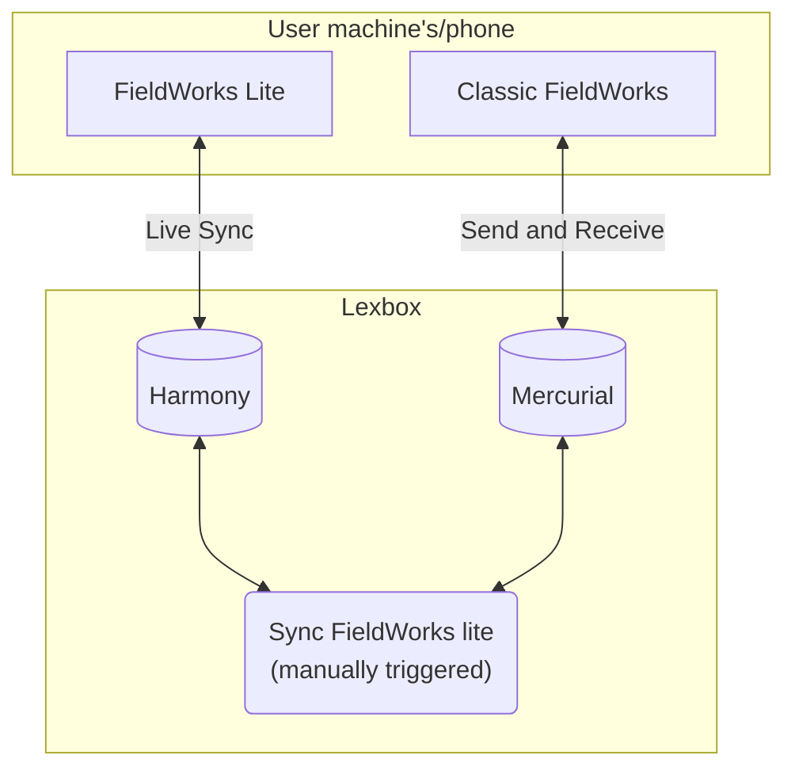

# FieldWorks Lite

## Development

### Prerequisites
 * [dotnet sdk](https://dotnet.microsoft.com/en-us/download)
 * [node](https://nodejs.org/en/download/)
 * [Taskfile](https://taskfile.dev/installation/)
    * windows: `winget install Task.Task`
    * linux: `sudo snap install task --classic` or other options on their website
    * mac: `brew install go-task/tap/go-task`
    * via npm: `npm install -g @go-task/cli`

### Running the project

from repo root you will be able to develop the UI as well. From this folder it will just run the backend and use the most recent built of the frontend for the UI.
```bash
task web-for-develop
```

## High level project flow diagram


