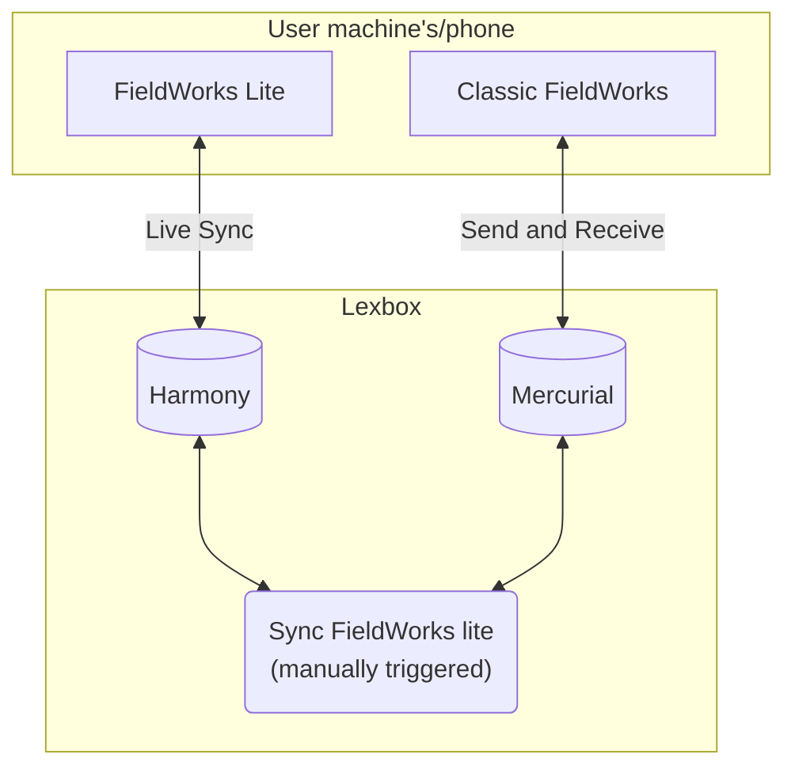

# FieldWorks Lite

## Development

### Prerequisites
 * [dotnet sdk](https://dotnet.microsoft.com/en-us/download)
 * [node](https://nodejs.org/en/download/)
 * [Taskfile](https://taskfile.dev/installation/)
    * windows: `winget install Task.Task`
    * linux: `sudo snap install task --classic` or other options on their website
    * mac: `brew install go-task/tap/go-task`
    * via npm: `npm install -g @go-task/cli`

### Running the project

from repo root you will be able to develop the UI as well. From this folder it will just run the backend and use the most recent built of the frontend for the UI.
```bash
task web-for-develop
```

## High level project flow diagram



### Adding a new Harmony change

1. Create a change class.
Reference [CreateComplexFormType](./LcmCrdt/Changes/CreateComplexFormType.cs) for a simple example of creating a new object.
Reference [AddComplexFormTypeChange](./LcmCrdt/Changes/Entries/AddComplexFormTypeChange.cs) for an example of editing an existing object.
2. Register that change class in [LcmCrdtKernel.ConfigureCrdt](./LcmCrdt/LcmCrdtKernel.cs)
3. Add the change to [UseChangesTests.GetAllChanges](./LcmCrdt.Tests/Changes/UseChangesTests.cs)

Things to watch out for

#### any constructor parameter names must match the field/property they are assigned to
Example: this will not work as the json serializer must match the property name with the argument name
```c#
public class MyChange
{
    public MyChange(string userName)
    {
        Name = userName;
    }
    public string Name { get; set; }
}

```
In this case, `string userName` should be changed to `string name` to match the property.
One place this is important is that all changes extend either `CreateChange` or `EditChange`, which takes an `Guid entityId` argument in it's primary constructor.
The property that is assigned to is also called `entityId` and so the constructor argument in your change must also be `entityId`.
There is a test to guard from mistakes which would prevent deserialization of changes in [ChangeSerializationTests.CanRoundTripChanges](./LcmCrdt.Tests/Changes/ChangeSerializationTests.cs)

#### any id references should be checked to see if the object being referenced is deleted
Due to syncing, a change could reference an object which has been deleted.
For example, [AddComplexFormTypeChange](./LcmCrdt/Changes/Entries/AddComplexFormTypeChange.cs) 
will ensure that the complex form type exists inside the `ApplyChange` method, if it doesn't exist then it won't add to type.
In some cases this may mean that the object being modified is actually deleted.
For example, in [CreateSenseChange](./LcmCrdt/Changes/CreateSenseChange.cs) if the Entry is deleted then the sense is also deleted
