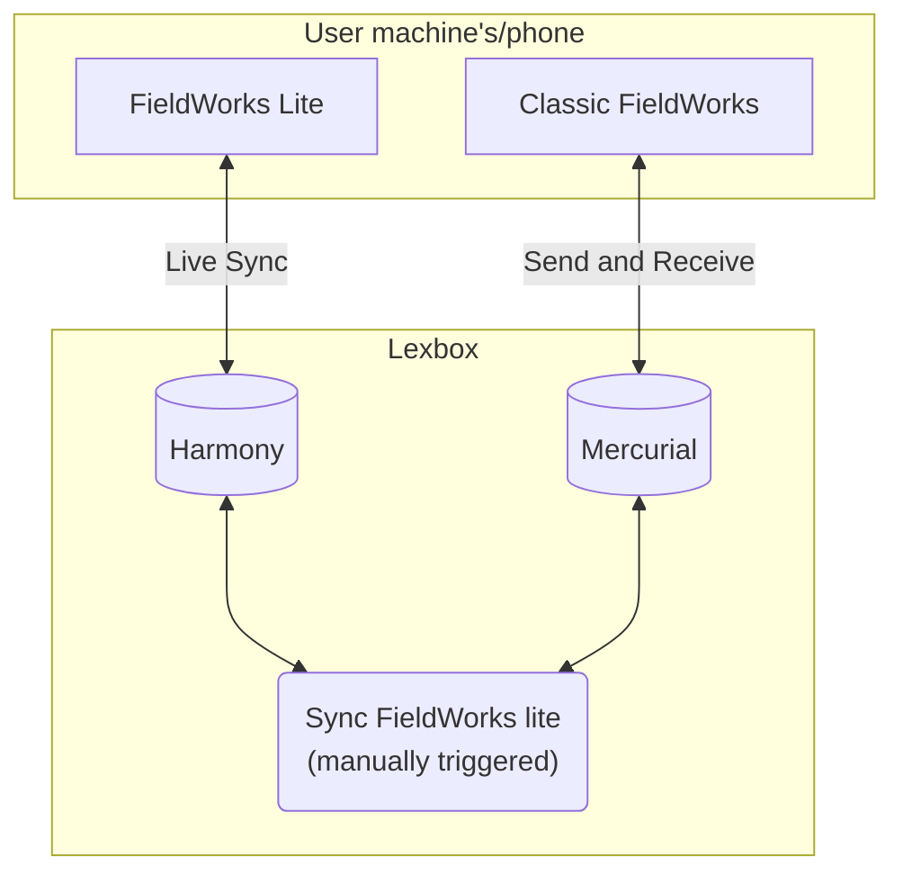

# FieldWorks Lite

## Development

### Prerequisites
 * [dotnet sdk](https://dotnet.microsoft.com/en-us/download) currently 9.0 is required
 * [node](https://nodejs.org/en/download/)
 * [Taskfile](https://taskfile.dev/installation/)
    * windows: `winget install Task.Task`
    * linux: `sudo snap install task --classic` or other options on their website
    * mac: `brew install go-task/tap/go-task`
    * via npm: `npm install -g @go-task/cli`
* .Net Maui workload
```bash
sudo dotnet workload restore
```
* XCode (for MacOS and iOS)
* Android SDK API 35+ (can be installed via Android Studio)
  * Java SDK 17 (for Android)

### Running FWLite Web (typical workflow)

from repo root:
```bash
task fw-lite-web
```
this will start the frontend vite server (in `frontend/viewer`) and the backend web server (in `backend/FwLite/FwLiteWeb`).

### Running Tests
For .Net tests, you can run them from the command line, in the repo root:
```bash
dotnet test FwLiteOnly.slnf 
```

### Building for a specific framework
```bash
dotnet build -f net9.0-ios
```
You can choose which framework to build for with the `-f` flag.

## High level project flow diagram



### Adding a new Harmony change

1. Create a change class.
Reference [CreateComplexFormType](./LcmCrdt/Changes/CreateComplexFormType.cs) for a simple example of creating a new object.
Reference [AddComplexFormTypeChange](./LcmCrdt/Changes/Entries/AddComplexFormTypeChange.cs) for an example of editing an existing object.
2. Register that change class in [LcmCrdtKernel.ConfigureCrdt](./LcmCrdt/LcmCrdtKernel.cs)
3. Add an instance of the change to [UseChangesTests.GetAllChanges](./LcmCrdt.Tests/Changes/UseChangesTests.cs) to demonstrate that it works.

Things to watch out for

#### Constructor parameter names must match the field/property they are assigned to
The JSON deserializer maps PascalCase property names to camelCase constructor parameter names. So, they need to be the same.

For example, this will not work:
```c#
public class MyChange
{
    public MyChange(string userName)
    {
        Name = userName;
    }
    public string Name { get; set; }
}

```
In this case, `string userName` should be changed to `string name` to match the property.
One place this is important is that all changes extend either `CreateChange` or `EditChange`, which both take a `Guid entityId` argument in their primary constructors.
The property that is assigned to is also called `EntityId`, so the constructor argument in **your** change must also be called `entityId`.
There is a test to guard from mistakes which would prevent deserialization of changes in [ChangeSerializationTests.CanRoundTripChanges](./LcmCrdt.Tests/Changes/ChangeSerializationTests.cs)

#### Referenced objects should be checked to see if they have been deleted
Due to syncing, a change could reference an object which has been deleted.
For example, [AddComplexFormTypeChange.ApplyChange](./LcmCrdt/Changes/Entries/AddComplexFormTypeChange.cs) 
ensures that the complex form type actually exists. If it doesn't exist or has been deleted then it is not added to the entry.
In some cases this may mean that the object being modified/created is actually deleted.
For example, in [CreateSenseChange](./LcmCrdt/Changes/CreateSenseChange.cs) if the Entry is deleted then the sense is also deleted.
