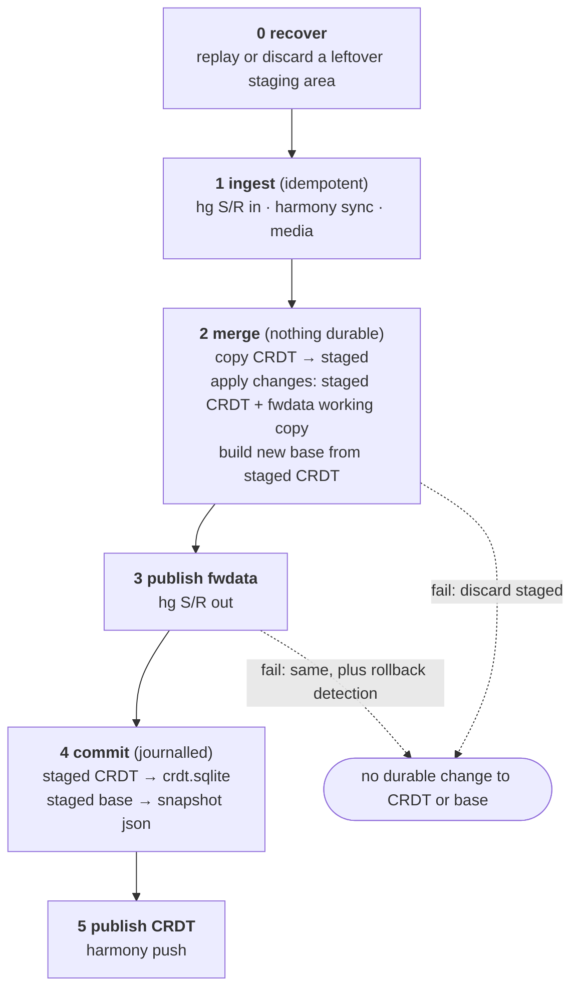

# Making the FwHeadless sync atomic

## Why

A dry-run sync of one production project took six and a half hours and reported roughly 1,700 changes
bound for fwdata, on a project where three of about ninety-six thousand CRDT commits were written by a
person. Investigating that turned up a merge base a year older than the CRDT it claimed to describe,
and the reason it was stale: a sync that dies part way through leaves the CRDT advanced and the merge
base untouched.

That is not only slow. A stale merge base makes the sync push its own leftover work into fwdata, over
the top of what FieldWorks users have since edited.

## The invariant

> **Every change the sync applies to the CRDT on fwdata's behalf must be recorded in the merge base,
> or not applied at all.**

Note the qualifier "on fwdata's behalf". A CRDT change the merge base doesn't know about is *normal*
when a FW Lite user made it, and is the entire reason the second sync pass exists. It is a bug only
when the sync itself put it there, because then the second pass reads the sync's own leftovers as user
intent and pushes them into fwdata.

Two corollaries, both of which have to hold:

- The base must never claim **less** than what was applied. Then the first pass re-applies work already
  done, and the second pass pushes the leftovers into fwdata.
- The base must never claim **more** than what was applied. Then the first pass cannot see real fwdata
  changes and silently drops them.

Neither direction is safe, so the base and the CRDT have to move together or not at all.

## Vocabulary

- **pass 1** — `CrdtFwdataProjectSyncService.SyncInternal`'s first entry sync: `before` = the merge
  base, `after` = fwdata, writes to the CRDT. Applies *fwdata's changes since the base*.
- **pass 2** — the second: `before` = fwdata, `after` = the CRDT, writes to fwdata. Pushes *whatever
  the CRDT holds that fwdata does not*.
- **merge base** — `{project}_snapshot.json`, the recorded "last agreed state" of the two stores.

The asymmetry matters: pass 1 is a real three-way merge and can only see what the base reveals; pass 2
is a two-way state push with no authorship input at all. So any CRDT-side state the base can't explain
flows to fwdata, whoever put it there.

## Why today's pipeline breaks the invariant

`SyncWorker.ExecuteSync` writes to the CRDT continuously from step 5 and rewrites the base once, at
step 7:

| step | action | on failure here |
|---|---|---|
| 4 | `SyncHarmonyProject()` (bidirectional) | fine |
| 5 | `Sync`/`Import` applies to CRDT **and** fwdata, hours long | CRDT advanced, base stale 🐛 |
| 6 | hg Send/Receive pushes fwdata | CRDT advanced, base stale, fwdata published 🐛 |
| 7 | `RegenerateProjectSnapshot` | base now correct |
| 8 | `SyncHarmonyProject()` again | fine |

So the window in which a failure corrupts the merge base spans the most expensive step in the system
plus a network round trip to Mercurial. It is also self-feeding: a poisoned base makes the next sync
slower, which makes it likelier to be interrupted.

`HasSyncedSuccessfully` does not help. It tests "snapshot file exists and is non-empty", which stays
true forever after the first successful sync, so the step-4 guard against pushing a partial sync cannot
fire in exactly the case it was written for.

## Target pipeline

The CRDT side of the sync runs against a **staged copy** of the database. The staged database and the
new merge base are then moved into place as one journalled operation. Nothing durable changes until
that point, so a failure anywhere in the expensive part costs time and nothing else.



Failure behaviour, phase by phase:

| fails in | local CRDT | merge base | fwdata | next run |
|---|---|---|---|---|
| 1 | pulled commits kept | untouched | pulled, committed in hg | normal |
| 2 | untouched | untouched | working copy holds the abandoned attempt's writes | recomputes from scratch |
| 3 | untouched | untouched | published or rolled back | recomputes; rollback detection unchanged |
| 4 | journal replayed | journal replayed | published | converges |
| 5 | committed | committed | published | pushes in phase 1 |

Two cases worth spelling out.

**Failure between 3 and 4**: fwdata is published but the CRDT and the base still describe the pre-sync
world. The next run pulls those changes back in through pass 1 and re-derives the same result, because
what it published came from the CRDT in the first place. It converges, and it converges in the safe
direction (fwdata's published state wins).

**Failure in 2, after pass 2 has already written to the fwdata working copy.** The staged CRDT work is
discarded, but fwdata's working copy keeps those writes and the next run's Send/Receive publishes them.
That still converges, for the same reason: the next run reads them back into the CRDT, where they
already are. Reverting the working copy (`hg revert`) would be tidier and is listed under deferred
work; it is not needed for correctness, and it needs new Mercurial plumbing.

Publishing fwdata stays *before* the commit point on purpose. The existing note in `ExecuteSync` is
right: if the base moved forward and the fwdata push were then rejected and rolled back, the next sync
would read the rollback as fwdata-side deletions and apply them to the CRDT. Keeping the push first
preserves that reasoning and shrinks the corrupting window to two local file renames, which the journal
then closes.

## The commit journal

Committing means updating two files: `crdt.sqlite` and the snapshot json. Both intermediate states are
the bug:

- db moved, base not: the base claims less than was applied.
- base moved, db not: the base claims more than was applied.

So the order cannot be chosen to be safe, and a write-ahead intent record is required. A
`{project}_sync-journal.json` next to the project records the staged paths and one of two states:

- `Staged` — staged files exist, nothing has been moved. Recovery: delete them and carry on.
- `Committing` — recovery: redo the moves from the top and delete the journal.

Redo-from-the-top is safe because each move is skipped when its source is already gone, so replay from
any interruption point lands on the same end state.

Replacing `crdt.sqlite` discards whatever was there. That is acceptable because the previous run pushed
all of its commits to the lexbox server in phase 5, and anything it did not push is also in the staged
copy (the copy is taken after phase 1). The local database is a working copy, not a source of truth.

## Staged copy: the awkward questions

- **Cost.** `SqliteConnection.BackupDatabase` on a few hundred MB of local file is seconds. The dry-run
  path already does this on every run via `OpenTempProjectCopy`. It is noise next to a sync measured in
  hours, and it is the price of the guarantee.
- **Disk.** Peak usage doubles for the duration of a sync. Sized per project, not per fleet, since syncs
  are serialised per project.
- **Concurrent writers.** `SyncHostedService` serialises jobs per project, and the other FwHeadless
  routes only read. To make that an enforced fact rather than an assumption, the staging area records
  the source database's head commit when it copies and refuses to commit if the head moved.
- **Harmony commit identity.** Untouched. The staged database is a byte copy, and pass 1's commits are
  created in it exactly as they would have been created in the original. Phase 5 pushes from the
  committed database, so the server sees the same commits it would have seen.
- **Open connections.** The real database must not be open when its file is replaced. The worker
  therefore opens it in phases 1 and 5 only, in scopes it disposes, and clears the SQLite pool before
  the move.
- **Media files.** Media lives outside the database and is synced in phase 1. Media metadata commits land
  in the real database before the copy is taken, so they survive it.
- **Import.** The first sync for a project has no merge base yet, so there is no second pass and nothing
  that can push CRDT state into fwdata. Import therefore keeps running against the real database, which
  keeps `MiniLcmImport` resumable. A failed import leaves no merge base, so the next run imports again
  rather than syncing against a base that describes a half-imported project.

## Merge base provenance

The snapshot currently records no provenance at all, which is why the investigation had to date it by
file mtime and guess at its origin from entity counts. The base now carries:

```json
"Provenance": { "CrdtCommitId": "...", "TakenAt": "..." }
```

`CrdtCommitId` is the CRDT head at the moment the base's contents were read. It gives us, for free:

- an exact staleness test instead of heuristics over file dates and entity counts;
- the argument to `POST /regenerate-snapshot?commitId=…`, so a base can be rebuilt at the commit it was
  meant to describe;
- a way to tell a base belonging to this project from a foreign one.

It is written with `[JsonIgnore(WhenWritingNull)]`, so existing snapshot files round-trip byte for byte
and snapshots taken from fwdata stay unstamped.

## Detection, and why it is not enforcement

Atomic commit stops the pipeline from producing a lying base. It does nothing about bases that are
already lying, and we do not yet know how many projects have one.

`MergeBaseHealthService` answers "is this base stale?" by looking for commits after `CrdtCommitId` that
the sync itself authored. Sync-authored commits after the recorded base can only mean an earlier sync
applied fwdata changes the base never learned about. Human and FW Lite commits after the base are normal
and are ignored.

At sync time this is **logged, not enforced**, and gated by `FwHeadlessConfig.StaleMergeBaseAction`
(`Warn` by default, `Fail` available). Enforcement first would turn one bad project into a fleet-wide
sync outage, and the honest repair for a stale base is a judgement call: rebasing on the CRDT means
"CRDT wins", rebasing on fwdata means "fwdata wins", and which is right depends on how much real user
data each side holds.

Rollout order: ship the diagnostic, survey the fleet, repair what it finds, then flip the default to
`Fail`.

Provenance limitation, stated plainly: "sync-authored" is recognised by the commit author name
(`LcmCrdtConfig.DefaultAuthorForCommits`, `FieldWorks` in FwHeadless), the same signal
`SnapshotAtCommitService.DeleteCommitsAfter` already uses. It is correct for FwHeadless, where no user is
signed in. It would under-report for a sync run by a signed-in user, which no production path does today.
When no author is configured at all the check reports `Unverifiable` rather than guessing, because then
sync commits are indistinguishable from a signed-out user's.

## What the tests hold down

| tests | what they cover |
|---|---|
| `Testing/FwHeadless/Services/SyncWorkerTests` → `SyncWorkerInterruptionTests` | a sync that throws, or whose fwdata push fails, leaves the CRDT database and the merge base byte-for-byte as they were; a committed sync moves both; a leftover staging area is discarded and an interrupted commit is finished before the next sync reads the base |
| `FwLiteProjectSync.Tests/SyncStagingTests` | staged writes are invisible until commit; commit moves both files; disposal discards; commit refuses if something else wrote to the project meanwhile; journal replay for both states |
| `FwLiteProjectSync.Tests/MergeBaseHealthServiceTests` | sync commits after the base read as stale, people's commits after the base do not, a base with no provenance or a foreign commit reads as unverifiable |
| `FwLiteProjectSync.Tests/StaleMergeBaseDamageTests` | the damage itself, each scenario run twice (stale base vs the base a finished sync would have written) |

The two tests that fail on today's `develop`, and are the point of the whole change, are in
`SyncWorkerInterruptionTests`: a sync that throws after writing to the CRDT, and a sync whose fwdata push
fails, both leave the database and the base untouched.

`SyncWorkerTestHarness` was changed to stop mocking `ProjectSnapshotService` and the staging area and use
the real ones against a real sqlite project, so the existing orchestration tests now assert against what
actually reaches the disk. Only the CRDT↔fwdata sync algorithm stays mocked; that is tested in
`FwLiteProjectSync.Tests`.

### What a stale base actually does

`StaleMergeBaseDamageTests` runs each scenario twice, once with the base an interrupted sync leaves
behind and once with the base the same sync would have written had it finished. Measured results:

| scenario | with a stale base |
|---|---|
| entry deleted in FLEx | comes back, in both stores |
| sense field cleared in FLEx | refilled from the CRDT |
| part of speech renamed in FLEx | reverted to the CRDT's old name |
| component deleted in FLEx | **survives**: the entry is re-created from fwdata by pass 1, which drops the CRDT's link |
| component refined from entry-level to sense-level | **survives**: the CRDT folds the new link into the one it already holds rather than keeping both |

The last two are worth knowing because they bound the blast radius. A stale base is not uniformly "CRDT
wins": for an object present in fwdata and missing from the base, pass 1 issues a create, and where that
create is a full-state write (entries) fwdata wins, nested collections included. The damage lands where
pass 1 has no reason to write at all (the object was deleted in fwdata) or where create-on-existing is a
no-op rather than a state overwrite (parts of speech). **Sweeping which entity types fall in which
category is the most useful follow-up available**, because it predicts exactly which fields this can hit.

## Considered and rejected

- **Resumable syncs.** Resuming means the merge base has to describe a half-applied state, which is the
  thing we are trying to abolish. A fresh attempt is cheap once attempts stop poisoning each other, and
  it reproduces failures instead of hiding them.
- **Writing the base incrementally as the sync applies changes.** Same objection, plus it makes the base
  a mutable accumulator whose correctness depends on every write path remembering to update it.
- **One long SQLite transaction over the real database.** Harmony manages its own transactions, an
  hours-long write transaction blocks everything else, and it still would not cover the base file.
- **Storing the base inside `crdt.sqlite`** so there is one file and no journal. Tempting, and it would
  make the commit a single rename. Rejected for now: it adds tens of MB of JSON to every database copy,
  needs a migration on the critical schema, and the plain file is what operational tooling reads.
- **Reviving `BeginBulkChangeBatch`** (the deferred-write API on the abandoned `sync-perf-wip` branch).
  Rejected earlier as an unmaintainable API burden; nothing here needs it.

## Deferred, in priority order

1. **A blast-radius guard on pass 2.** Pass 2 is a state push: it cannot distinguish "the CRDT has this
   because a user typed it" from "the CRDT has this because a sync half-applied it". With a correct base
   it does not need to, which is why this is not part of the fix. But a ceiling on destructive
   fwdata-bound changes per run, above which the sync refuses and asks for an operator, would have caught
   the roughly 1,700-change pass 2 that started this before it ran. The design question is what the
   ceiling is a function of, and that needs fleet numbers.
2. **Stamp the base with the hg revision** it was built against, and **revert fwdata's working copy** when
   a sync is abandoned. Both need the same new plumbing in `SendReceiveService`. The stamp is the direct
   test for "was this project's fwdata replaced?"; the revert makes an abandoned attempt leave no trace at
   all rather than one that converges on the next run.
3. **Make the base a pointer, not a file.** Store only `CrdtCommitId` and rebuild the base from Harmony
   history with `SnapshotAtCommitService` when a sync needs it. Then the base cannot disagree with the
   CRDT, because it is derived from it. Deferred on cost: `DataModel.RegenerateSnapshots` replays the whole
   history, which is minutes on a project with tens of thousands of commits.
4. **The perf work.** Expect a large speedup as a side effect of not re-applying work. Everything else (a
   redundant `AddEntryComponentChange` still costing a validated, snapshotted commit; `ValidateCommits`
   scanning all commits per commit) is tracked separately.

## Out of scope

This change addresses the merge base and nothing else. Two other failure sources found alongside it are
independent and need their own work: chorusmerge resolving unmergeable FieldWorks files in FwHeadless's
favour without anything checking the conflict reports it writes, and FwHeadless committing on a stale
parent because the pre-sync Send/Receive leaves the working copy behind the branch tip. Shipping this
should not be read as "the sync is safe now". It does help sideways in one respect: an aborted sync no
longer leaves the CRDT advanced, so it no longer generates the divergence that makes an extra merge
necessary.
