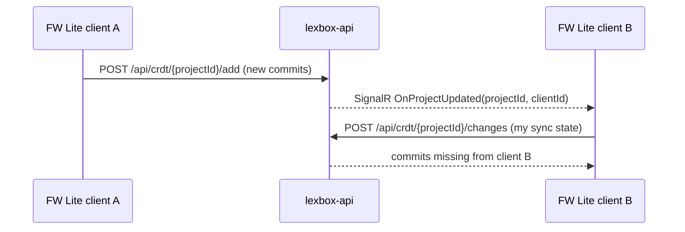
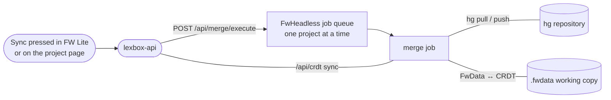

What Lexbox and FieldWorks Lite talk to, and over which protocol. Start here if you maintain another tool and want to connect it.

## Classic FieldWorks via Chorus (Mercurial)

FLEx desktop sends and receives through Chorus, which is a Mercurial client. Lexbox's .NET API proxies those requests to two containers sharing the repository volume: `hgweb` (standard hg wire protocol) and `hgresumable` (chunked, resumable transfer for bad connections).

| Route on lexbox-api | Purpose |
| --- | --- |
| `/{project-code}` or `/hg/{project-code}` | hg Send/Receive. The bare `/{project-code}` form is the URL baked into Chorus clients around the world, so it has the lowest route precedence. |
| `/api/v03` | hg-resumable Send/Receive |

Production hostnames all route to `lexbox`: `hg-public.languagedepot.org`, `hg-private.languagedepot.org`, `resumable.languagedepot.org` (and the matching `*.languageforge.org` names). Staging uses `hg-staging.languageforge.org` / `resumable-staging.languagedepot.org`; develop uses `hg-develop.lexbox.org` / `resumable-develop.lexbox.org`.

## Legacy Language Depot API

Older clients still call the Language Depot API, so it stays:

| Route | Used by |
| --- | --- |
| `POST /api/user/{userName}/projects` | Chorus/FLEx and Language Forge, to list a user's projects. Anonymous route; the password goes in the body and is checked against the stored hash. Returns identifier, name, repository URL and role per project. |

## CRDT sync: FieldWorks Lite ↔ Lexbox

FW Lite keeps the whole project locally in SQLite as a [SIL.Harmony](https://github.com/sillsdev/harmony) CRDT: every edit is a commit, and merging is order-independent, so there are no conflicts to resolve. Sync is plain HTTPS; SignalR only says "something changed, come and get it".

| Endpoint | Purpose |
| --- | --- |
| `GET /api/crdt/{projectId}/get` | server's sync state (head commits) |
| `POST /api/crdt/{projectId}/add` | push commits; the server then broadcasts `OnProjectUpdated` |
| `POST /api/crdt/{projectId}/changes` | send your sync state, stream back what you're missing |
| `POST /api/crdt/{projectId}/countChanges` | cheap "how far behind am I" count |
| `GET /api/crdt/listProjects`, `/lookupProjectId` | discovery |

The push hub is at `/api/hub/crdt/project-changes`; a client calls `ListenForProjectChanges(projectId)` to join the project group. All of it requires an auth token with the `SendAndReceive` scope. See [How sync works](/user-guide/how-sync-works) for the user-facing version.

## FwHeadless: the bridge between CRDT and Mercurial

FwHeadless owns a working copy of the FieldWorks project and reconciles both worlds: it pulls/pushes the `.fwdata` file over Mercurial, and syncs the same content as CRDT commits with lexbox-api.

**It is not a scheduler and it does not watch for changes.** The merge job runs only when a user asks for it: the Sync button in FW Lite or "Sync FieldWorks Lite" on the Lexbox project page. Both go through `POST /api/fw-lite/sync/trigger/{projectId}` on lexbox-api, which calls FwHeadless's `POST /api/merge/execute`, which queues the job. The queue is in-process and serialized, so one project syncs at a time and a project already queued is not queued twice. Callers watch `GET /api/merge/status` and `GET /api/merge/await-finished`. Media files ride along with the same job over `/api/media/*`.

## Platform.Bible extension

`platform.bible-extension/` is a Platform.Bible (paranext) extension named `lexicon`. On activation it launches a FW Lite process on `http://localhost:29348` and talks to it over HTTP REST, then exposes `lexicon.entryService` as a PAPI network object so other extensions can add, find and display dictionary entries. UI is React WebViews registered with the platform.

## APIs Lexbox offers

| API | Where | Notes |
| --- | --- | --- |
| GraphQL | `/api/graphql` | Hot Chocolate; this is what the SvelteKit UI uses. Explorer (Banana Cake Pop) at `/api/graphql/ui`. |
| REST | `/api/**` | Includes `/api/crdt/*`, `/api/fw-lite/sync/*` and TUS project upload at `/api/project/upload-zip/{project-code}`. Swagger UI at `/api/swagger`. |
| Health | `/api/healthz` | |
| Security contact | `/.well-known/security.txt` | [security.txt standard](https://securitytxt.org/) |

## Localization: Crowdin

Source strings live in gettext catalogs; Crowdin holds the translations. Inbound, Crowdin opens a PR from `l10n_develop` on each sync. Outbound is export-only from GitHub's side, so updated source strings are pushed with the Crowdin CLI (`crowdin push sources`). All seven target locales are machine-translation covered, which is why brand names (`Lexbox`, `FieldWorks`, `SIL`) need glossary "Trademark" entries — MT otherwise translates them literally.

## Observability: OpenTelemetry → Honeycomb

Every service exports OTEL traces to an otel-collector sidecar (gRPC 4317, HTTP 4318), which forwards to [Honeycomb](https://ui.honeycomb.io/sil-language-forge/). The "Error code" shown at the bottom of an error message in the app is the trace ID: Ctrl+click it to open the trace. Locally, traces go to the Aspire dashboard on port 18888; set `HONEYCOMB_API_KEY` in `deployment/local-dev/local.env` to send them to Honeycomb instead.
