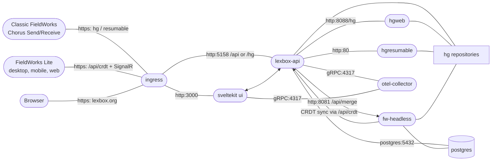

Three things live in this repo. Lexbox and FwHeadless run server-side and share one database and one set of Mercurial repositories; FieldWorks Lite is a client app with its own local copy of each project.

| Part | What it is |
| --- | --- |
| **Lexbox** (formerly Language Depot) | The web app and project host: user/org/project management, permissions, and the server side of both sync protocols. SvelteKit UI in front of a .NET API. |
| **FieldWorks Lite** (FW Lite) | A lightweight dictionary editor for desktop, mobile and browser. Keeps a local SQLite copy of the project and syncs it to Lexbox as CRDT commits. |
| **FwHeadless** | The server-side bridge between the CRDT world (FW Lite) and the Mercurial world (classic FieldWorks). It runs the merge job that reconciles the two. |

Classic FieldWorks (FLEx) is not in this repo, but it's a first-class client: it talks to Lexbox with Chorus Send/Receive over Mercurial.

## Deployed system



Everything above runs in Kubernetes; the same manifests serve production, staging, develop and local development (see [deployment](https://github.com/sillsdev/languageforge-lexbox/blob/develop/deployment/README.md)). Telemetry is OpenTelemetry, exported to Honeycomb.

## Tech stack

- **Backend**: .NET 10, C#, Entity Framework Core, GraphQL (Hot Chocolate)
- **Frontend**: SvelteKit, TypeScript
- **FW Lite client**: .NET MAUI (desktop/mobile) or an ASP.NET Core host (web), both driving the same Svelte viewer
- **CRDT substrate**: [SIL.Harmony](https://github.com/sillsdev/harmony), stored in SQLite on the client
- **Database**: PostgreSQL
- **Version control for FieldWorks projects**: Mercurial (hgweb + hgresumable), driven by Chorus
- **Infrastructure**: Docker, Kubernetes, Skaffold, Tilt

## Repo layout

```text
languageforge-lexbox/
├── backend/
│   ├── LexBoxApi/       # Main API (ASP.NET Core + GraphQL)
│   ├── LexCore/         # Core domain models
│   ├── LexData/         # Data access layer (EF Core)
│   ├── FwLite/          # FW Lite apps (MAUI, Web) and the MiniLcm API
│   ├── FwHeadless/      # Headless FieldWorks sync service
│   └── Testing/         # Test projects
├── frontend/            # Lexbox SvelteKit web app
├── frontend/viewer/     # FieldWorks Lite frontend Svelte code
├── deployment/          # K8s/Docker configs
├── docs/                # This documentation site
├── hgweb/               # hgweb Dockerfile and config
├── otel/                # OpenTelemetry collector config
├── crowdin/             # Localization workflow
└── platform.bible-extension/   # Platform.Bible extension
```

## Next

- [Integrations](./integrations.md) — how FW Lite and Lexbox talk to FieldWorks, Platform.Bible and everything else.
- [Development setup](../development/setup-windows.md) — get it running locally.
