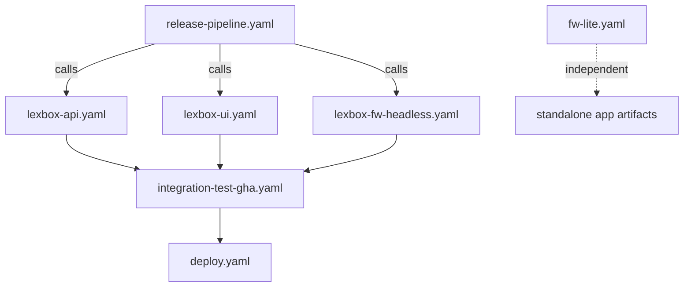

Builds and deployments run on GitHub Actions. Most build workflows are `workflow_call`-only so `release-pipeline.yaml` can compose them; deployment goes through a separate fleet repo.

The full reference (every workflow, known flaky failures, troubleshooting) is [`.github/AGENTS.md`](https://github.com/sillsdev/languageforge-lexbox/blob/develop/.github/AGENTS.md).

## Workflow dependencies

`fw-lite.yaml` stands apart: core .NET build and tests on Linux (`FwLiteCore.slnf`), MAUI on Windows, its own test suite, and it publishes standalone apps for five platforms instead of Docker images. It never deploys to Kubernetes.

Docker images for the deployed services go to `ghcr.io/sillsdev/` (`lexbox-api`, `lexbox-ui`, `lexbox-fw-headless`, `lexbox-hgweb`), tagged with the branch name, PR number, commit SHA, and `latest` on main.

## Environments

| Environment | Domain | When deployed |
|---|---|---|
| develop | develop.lexbox.org | every push to develop |
| staging | staging.languagedepot.org | manual |
| production | lexbox.org, languagedepot.org | manual, with approval |

Each runs the same set of workloads in its own Kubernetes cluster: the lexbox pod (.NET API plus OTEL collector), Postgres, the hg pod (hgweb and hg-resumable), and the SvelteKit UI. Non-production environments add an init container that seeds a test repo. Per-environment hostnames are listed in [`deployment/README.md`](https://github.com/sillsdev/languageforge-lexbox/blob/develop/deployment/README.md).

## Fleet repo and GitOps

Nothing in CI talks to a cluster directly. A deploy job builds the image, runs `kubectl kustomize` to render `resources.yaml`, clones the fleet repo, copies the manifest in with the new image tag, and pushes. The cluster watches the fleet repo and applies what it finds. That indirection buys an audit trail of every deployment and makes a rollback a revert in the fleet repo.

Kubernetes config lives in `deployment/`: a shared `base/` plus one Kustomize overlay per target (`develop/`, `staging/`, `production/`, `gha/` for integration tests in GitHub Actions, and `local-dev/`). Each overlay includes `base/` and patches in its own settings.

If a deployment doesn't show up: check the deploy job actually ran (production needs approval), that the fleet repo was updated, that the cluster pulled it, and the `https://<domain>/api/healthz` endpoint.
