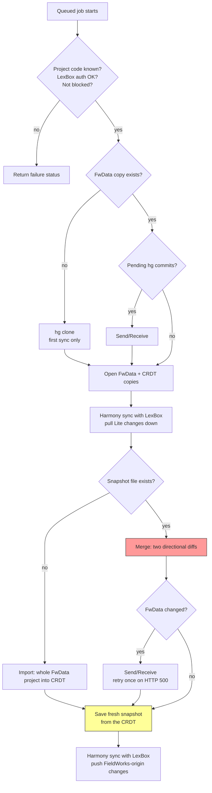

FwHeadless is the only place where CRDT data and FwData meet. It keeps a per-project CRDT database *and* a
Mercurial working copy of the FieldWorks project, and merges between them on request.

:::warning Data-loss territory
This is the highest-risk code in the repo. A bug here can overwrite FieldWorks edits, corrupt the hg repo, or
produce divergent data that can't be reconciled. Read `backend/FwHeadless/AGENTS.md` and
`backend/FwLite/AGENTS.md` before changing anything under `FwLiteProjectSync/`.
:::

## The merge is user-triggered, always

There is no scheduler, no cron and no Mercurial hook. A merge happens because someone pressed a button:

- FieldWorks Lite → the Sync dialog's **Sync** button, or
- LexBox → **Sync FieldWorks Lite** on the project page.

Both go `POST /api/fw-lite/sync/trigger/{projectId}` (LexBox) → `POST /api/merge/execute` (FwHeadless), which
only *queues* the job. `SyncHostedService` runs one global sequential worker, so projects are processed one at a
time and a queued project waits. Queuing is deduplicated: triggering a project that's already queued or running
is a no-op.

The client then polls `await-sync-finished` for the result. FieldWorks Lite gives up after **15 minutes**
(re-requesting every 25 s to dodge the 30 s HTTP timeout); the LexBox web button keeps polling. The **first-ever**
sync for a project clones the hg repo and imports every entry into a new CRDT database, which takes minutes.

## The sync cycle

**The snapshot** is a JSON file (`{project}_snapshot.json`) kept next to the project's data. It records the whole
dictionary state — entries, senses, parts of speech and the rest — as of the last successful merge. Two things
depend on it:

- It's the baseline the merge diffs against (see [Merge semantics](#merge-semantics) below). Without a "what it
  was last time", there's no way to tell what each side changed.
- Its mere presence is how FwHeadless knows a project has synced before. No snapshot means the first-ever sync,
  which *imports* the whole FwData project into a new CRDT instead of merging.

It's rewritten only **after** the post-merge Send/Receive succeeds, and **from the CRDT api**, not from FwData —
see the long comment in `SyncWorker.ExecuteSync` for why both details matter.

## Merge semantics

`CrdtFwdataProjectSyncService.Sync` computes two directional diffs per entity type against the snapshot:

1. snapshot → current FwData, applied to the CRDT
2. current FwData → current CRDT, applied to FwData

Because step 1 runs first, its result is already in the CRDT when step 2 reads it. So:

| Field changed since last merge | Result |
|---|---|
| In FieldWorks only | FieldWorks value wins (arrives in CRDT via step 1) |
| In FieldWorks Lite only | Lite value wins (arrives in FwData via step 2) |
| On both sides | **FieldWorks Classic value wins** |

Entity order matters — writing systems, publications, parts of speech, semantic domains, complex form types and
morph types are synced before entries, because entries reference them. Complex forms are two-phase for the same
reason. On the hg side, Chorus does the merging between FwHeadless's copy and other users' commits; FwHeadless
never resolves those itself.

## Failure modes

`SyncJobResult.Status` (`LexCore/Sync/SyncJobResult.cs`):

| Status | Meaning |
|---|---|
| `Success` | Merge completed; the result carries CRDT and FwData change counts. |
| `SuccessHarmonyOnly` | Only the Harmony sync ran (the `sync-harmony` recovery endpoint). |
| `ProjectNotFound` | No project with that id. |
| `UnableToAuthenticate` | FwHeadless couldn't authenticate to LexBox — checked up front so the job fails fast. |
| `SyncBlocked` | Project is blocked from syncing (HTTP 423 from the trigger endpoint). |
| `ProjectIncompatible` | The clone produced no `.fwdata` file — e.g. the repo isn't a FieldWorks project. |
| `SendReceiveFailed` | hg Send/Receive failed before or after the merge. |
| `CrdtSyncFailed` / `UnableToSync` / `UnknownError` | Harmony sync or the job itself failed. |
| `SyncJobNotFound`, `SyncJobTimedOut`, `TimedOutAwaitingSyncStatus` | Polling outcomes, not merge outcomes: the job was never queued, it outlived the wait, or the client's own wait expired while the job kept running. |

**Blocking.** If Chorus reports a rollback during Send/Receive, FwHeadless blocks the project from syncing
immediately (before *and* after the merge) and returns `SyncBlocked`. A blocked project is rejected at the
trigger endpoint with HTTP 423 and re-checked inside the worker in case it was blocked while queued. Unblocking
is a deliberate admin action via `/api/fw-lite/sync/unblock`.

Other landmines worth knowing: a stale snapshot makes every subsequent diff wrong; stuck `.hg/wlock`
files hang Send/Receive; and an `FdoDataModelVersion` mismatch with FieldWorks risks corrupt data.
