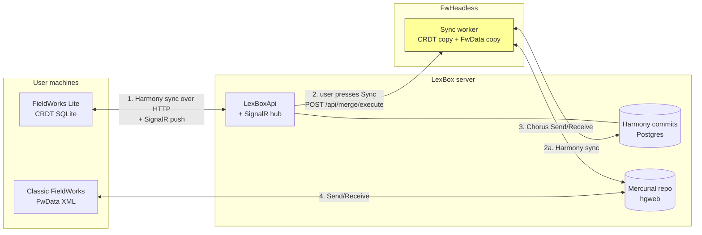

Data gets from FieldWorks Lite to classic FieldWorks (and back) through four separate hops, each with its own
trigger, transport and failure modes. Nothing is one big pipeline: hops 1 and 2 are the only ones a user starts
directly, and only hop 2 moves data between the CRDT world and the Mercurial world.

For the non-technical version, see the [user guide explainer](/user-guide/how-sync-works).

## Hop 1 — FieldWorks Lite ↔ LexBox (Harmony CRDT)

| | |
|---|---|
| Trigger | Every local edit, project open, a SignalR `OnProjectUpdated` push, listener (re)connect, and a 5-minute recovery check. See [CRDT sync](./crdt.md). |
| Travels | Harmony commits (each a list of changes) in both directions, plus pending media uploads/downloads. |
| Transport | HTTP to `/api/crdt/{projectId}/…`; push notifications over the SignalR hub `/api/hub/crdt/project-changes`. |
| Code | `FwLiteShared/Sync/SyncService.cs`, `FwLiteShared/Projects/LexboxHubConnection.cs`, `LexBoxApi/Controllers/CrdtController.cs` |

Failure modes: not signed in (`SyncStatus.NotLoggedIn`), server unreachable or token unrefreshable
(`SyncStatus.Offline`) — both leave the local edits safely queued for the next sync. A push listener that dies
and never recovers is worse: edits still sync out on the next local edit, but incoming changes stop arriving
until something else triggers a sync.

## Hop 2 — LexBox → FwHeadless merge job

| | |
|---|---|
| Trigger | **A user, always.** FieldWorks Lite's Sync dialog, or "Sync FieldWorks Lite" on the LexBox project page. No scheduler, no hg hook. |
| Travels | Only the project id: `POST /api/fw-lite/sync/trigger/{projectId}` → FwHeadless `POST /api/merge/execute`, which queues the job. |
| Runs | One global sequential worker; a second project waits its turn. |
| Code | `LexBoxApi/Controllers/SyncController.cs`, `FwHeadless/Routes/MergeRoutes.cs`, `FwHeadless/Services/SyncHostedService.cs` |

Failure modes: 403 (FwHeadless cannot authenticate to LexBox), 404 (project unknown), 423 (project blocked from
syncing). The client then polls for the result — details and the full status list in
[The FwHeadless merge](./fwheadless-merge.md).

## Hop 3 — FwHeadless ↔ the Mercurial repo

| | |
|---|---|
| Trigger | Inside the merge job only: a Send/Receive before the merge if there are pending hg commits (a clone on the very first sync), and one after the merge if the merge wrote FwData changes. |
| Travels | Mercurial changesets of the project's `.fwdata` file and friends. Chorus/LfMergeBridge does the hg-side merging. |
| Code | `FwHeadless/Services/SendReceiveService.cs`, `FwHeadless/Services/SendReceiveHelpers.cs` |

Failure modes: `SendReceiveFailed` (HTTP 500 is retried once); a Chorus-detected rollback blocks the project from
further syncing; a clone that produces no `.fwdata` reports `ProjectIncompatible` (e.g. the repo is a WeSay
project); stuck `.hg/wlock` files hang operations; an `FdoDataModelVersion` mismatch between FwHeadless and
FieldWorks is a data-corruption risk.

## Hop 4 — Mercurial repo ↔ classic FieldWorks

| | |
|---|---|
| Trigger | The user's own Send/Receive in FieldWorks. |
| Travels | Mercurial changesets; Chorus merges the FwData XML on the user's machine. |

Failure mode that matters most: none of the FieldWorks Lite edits reach the FieldWorks user until they do a
Send/Receive, and their own edits only reach FieldWorks Lite once someone presses Sync (hop 2). The end-to-end
path is only as live as its slowest manual step.

## Which copy wins

FwHeadless keeps its own CRDT database *and* its own FwData working copy per project. The merge diffs both
against the snapshot (a JSON file recording the state as of the last successful merge) and applies
**FwData → CRDT first**, so a field edited on both sides since the
last merge ends up with the FieldWorks Classic value. Within hop 1 (Lite clients only) there is no such
asymmetry — Harmony merges per change. See [The FwHeadless merge](./fwheadless-merge.md).
