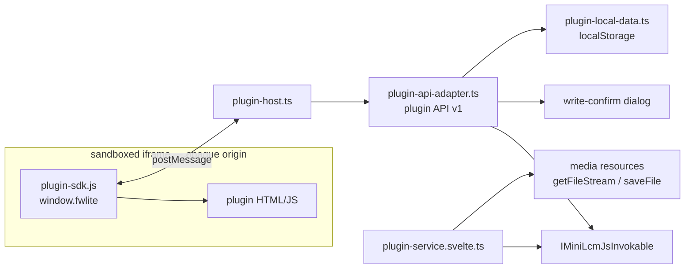

# FW Lite plugins

A plugin is **one self-contained HTML file**, written by a project member (usually with AI help),
that runs inside FW Lite and works with the open project's dictionary data. The `Plugin` CRDT
entity carries only metadata (name, description, extracted manifest, file reference); the HTML
itself is stored as a **media resource** — the same Harmony `RemoteResource` path audio and
pictures use — so the bytes upload/download on demand, work offline once cached, travel through
Mercurial send/receive in the project's `LinkedFiles`, and are visible to FieldWorks as ordinary
(inert) linked files. Plugin files are immutable: each edit uploads a new content-named file and
repoints the entity, so synced/cached copies can never go stale.

## Architecture

- **`plugin-manifest.ts`** parses what a plugin declares about itself in `<meta name="fwlite-plugin-*">`
  tags: `permissions` (`internet`, `edit`), `contexts` (`entry`), `requires` (`comments`, `history`).
  The manifest is extracted into the entity at save time (so lists and the entry menu never need the
  file) and re-parsed from the actual HTML wherever it matters for safety.
- **`plugin-service.svelte.ts`** owns persistence: uploading the HTML as a content-hash-named media
  file, building the entity, fetching HTML back (with offline/error outcomes), and carrying
  device-local grants across local edits.
- **`plugin-srcdoc.ts`** composes the document the iframe runs: injects the SDK and, unless the
  plugin declares the `internet` permission, a CSP `<meta>` that blocks network fetches. The result
  is loaded via a revocable Blob URL (not a `srcdoc` attribute or retained state) so multi-MB plugin
  HTML stays GC-able; the on-disk cache file remains the source of truth. The iframe uses
  `sandbox="allow-scripts allow-forms allow-modals allow-downloads"` — critically **without**
  `allow-same-origin`, so the plugin gets an opaque origin: no cookies, no app localStorage, no
  `window.parent` DOM access. One caveat the code and copy are honest about: nothing can stop a
  script from navigating its own frame (a potential exfiltration channel), so PluginRunView detects
  a second document load and stops the plugin.
- **`plugin-sdk.js`** is injected verbatim into every plugin and exposes the `fwlite` global.
  It is plain dependency-free JS by design.
- **`plugin-host.ts`** answers exactly one iframe (verified by window identity), forwards requests
  to the adapter, and caps in-flight requests. RPC errors are returned to the plugin, not the app's
  error handler.
- **`plugin-api-adapter.ts`** is the *entire* API surface plugins can reach (v1): the
  `PluginApiMethods` interface, an arg-decoder table (both compiler-checked to stay in sync), and
  the implementation. Reads are open; writes require the `edit` permission AND per-operation user
  approval with a complete field-level preview. `updateEntry` has compare-and-swap semantics
  (`conflict` error) so the preview provably matches the real effect. Comments/history are
  capability-gated areas a host may not support. Filters are structured — the gridify syntax is
  not exposed.
- **`plugin-local-data.ts`** provides per-plugin key-value storage (plugins have no storage of
  their own) and the two device-local, content-hash-pinned grants: run consent and write trust
  ("Always allow"). Local edits re-pin grants; changes arriving via sync ask again.
- **`plugin-prompt.ts`** generates the project-aware AI prompt (writing systems, parts of speech,
  domains, entry count baked in). It doubles as the public API documentation — **keep it in sync
  when changing the SDK or adapter**.

## Versioning rules

The plugin API is a public contract: team members will have working plugins stored in their
projects. For `fwlite` (SDK + adapter):

- Adding methods/fields is fine.
- Never remove or change the behavior of an existing method within v1; if unavoidable, bump
  `PLUGIN_API_VERSION` and keep v1 behavior for plugins that expect it.
- The `Plugin` CRDT entity and its change classes are forever — see `backend/FwLite/AGENTS.md`.
- New optional host features go through `capabilities` + the `requires` manifest, so plugins can
  run on hosts that lack them (e.g. a future FieldWorks host without comments/history).

## Security model (summary)

1. Opaque-origin sandbox — no app/API/cookie access, only postMessage.
2. Offline by default — CSP blocks network fetches unless the plugin declares `internet` (surfaced
   as a badge in the UI and on the consent screen); self-navigation can't be blocked, so it is
   detected and the plugin stopped.
3. Consent per content hash (name + description + HTML) before first run on each device.
4. Reads are open (same data the user can already see). Writes need the declared `edit` permission
   and are user-approved per operation — or auto-approved with ambient notifications once the user
   picks "Always allow for this plugin" (hash-pinned, per project, per device, revocable from the
   plugin card and the run toolbar).
5. Write previews are complete and honest: full recursive diffs against the entry's REAL current
   state (compare-and-swap), no silent truncation, bidi/control characters stripped.
6. Only project managers can add/edit/delete plugins (enforced in `CrdtMiniLcmApi`).

## Testing

`frontend/viewer/tests/ui/plugins.test.ts` runs against the in-browser demo project
(`task test:ui-standalone -- plugins`), covering consent, the postMessage bridge, write
approval/trust, and plugin creation. The demo project seeds example plugins (see `examples/`).
Unit tests live next to their modules (`*.test.ts`).
