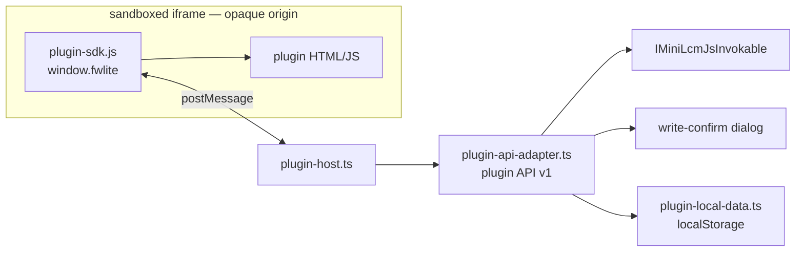

# FW Lite plugins

A plugin is **one self-contained HTML file**, written by a project member (usually with AI help),
that runs inside FW Lite and works with the open project's dictionary data. Plugins are stored in
the project's CRDT (`Plugin` entity), so they sync to the whole team like any other project data —
but they are never synced to FieldWorks/FwData.

## Architecture

- **`plugin-srcdoc.ts`** builds the iframe `srcdoc`: injects the SDK and, unless the plugin declares
  the `internet` permission (`<meta name="fwlite-plugin-permissions" content="internet">`), a CSP
  `<meta>` that blocks all network access. The iframe uses `sandbox="allow-scripts allow-forms
  allow-modals allow-downloads"` — critically **without** `allow-same-origin`, so the plugin gets an
  opaque origin: no cookies, no app localStorage, no `window.parent` DOM access.
- **`plugin-sdk.js`** is injected verbatim into every plugin and exposes the `fwlite` global.
  It is plain dependency-free JS by design.
- **`plugin-host.ts`** answers exactly one iframe (verified by window identity) and forwards
  requests to the adapter. RPC errors are returned to the plugin, not the app's error handler.
- **`plugin-api-adapter.ts`** is the *entire* API surface plugins can reach (v1). It exposes a
  deliberately small, stable subset of MiniLcm: reads plus `createEntry`/`updateEntry`, where every
  write requires per-operation user approval with a field-level preview. Filters are structured
  (semantic domain code, part of speech id) — the gridify syntax is not exposed.
- **`plugin-local-data.ts`** provides per-plugin key-value storage (plugins have no storage of
  their own) and tracks run consent per content hash — an edited or newly synced plugin asks again.
- **`plugin-prompt.ts`** generates the project-aware AI prompt (writing systems, parts of speech,
  domains, entry count baked in). It doubles as the public API documentation — **keep it in sync
  when changing the SDK or adapter**.

## Versioning rules

The plugin API is a public contract: team members will have working plugins stored in their
projects. For `fwlite` (SDK + adapter):

- Adding methods/fields is fine.
- Never remove or change the behavior of an existing method within v1; if unavoidable, bump
  `PLUGIN_API_VERSION` and keep v1 behavior for plugins that expect it.
- The `Plugin` CRDT entity and its change classes are forever — see `backend/FwLite/AGENTS.md`.

## Security model (summary)

1. Opaque-origin sandbox — no app/API/cookie access, only postMessage.
2. Offline by default — CSP blocks network unless the plugin declares `internet` (surfaced as a
   badge in the UI and on the consent screen).
3. Consent per content hash before first run on each device.
4. Reads are open (same data the user can already see); writes are individually user-approved.
5. Only project managers can add/edit/delete plugins (enforced in `CrdtMiniLcmApi`).

## Testing

`frontend/viewer/tests/plugins.test.ts` runs against the in-browser demo project
(`task playwright-test-standalone -- plugins`), covering consent, the postMessage bridge, and
plugin creation. The demo project seeds one example plugin (see `examples/`).
