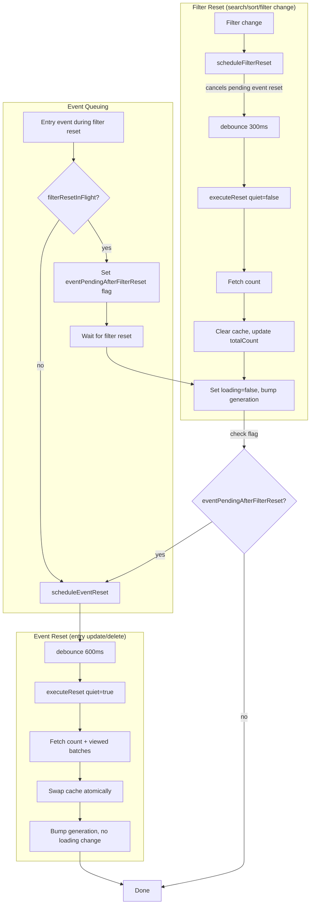

# EntryLoaderService

On-demand entry loading with batch caching for virtual scroll.

## Reset Flow

## Key Behaviors

- **Filter reset** shows loading state and clears cache
- **Event reset** is "quiet" - no loading flash, preloads viewed batches
- Events during filter reset are queued and processed after
- Filter reset cancels any pending event reset (will be superseded)
- Generation counter invalidates stale async operations
