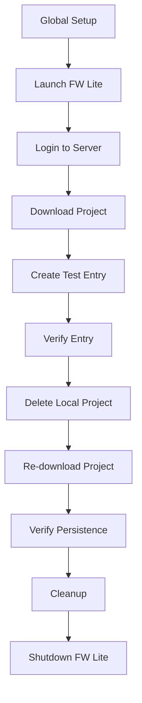

# FW Lite E2E Tests

This directory contains comprehensive end-to-end tests for FW Lite integration with LexBox. The test suite validates the complete workflow of downloading projects, creating entries, and verifying data persistence across local project management operations.

## Overview

The E2E test suite covers the following core scenarios:

1. **Complete Project Workflow**: Download project → Create entry → Delete local copy → Re-download → Verify persistence
2. **Smoke Tests**: Basic application launch and server connectivity
3. **Project Download**: Isolated project download and verification
4. **Entry Management**: Create, search, and verify lexical entries
5. **Data Persistence**: Verify data survives local project deletion and re-download
6. **Error Handling**: Test application behavior under error conditions
7. **Performance**: Validate reasonable response times for key operations

## Architecture

### Core Components

- **`fw-lite-integration.test.ts`**: Main test file with complete integration scenarios
- **`helpers/`**: Utility modules for common operations
  - `fw-lite-launcher.ts`: FW Lite application lifecycle management
  - `project-operations.ts`: UI automation for project and entry operations
  - `test-data.ts`: Test data generation and cleanup utilities
- **`fixtures/`**: Static test data and configuration
- **`test-scenarios.ts`**: Reusable test scenario implementations
- **`config.ts`**: Test configuration and environment variables
- **`types.ts`**: TypeScript type definitions

### Test Flow



## Setup

### Prerequisites

1. **Node.js**: Version 18 or higher
2. **FW Lite Binary**: Available at the configured path
3. **LexBox Server**: Running and accessible
4. **Test Project**: Available on the server (default: sena-3)

### Installation

1. Install dependencies:
   ```bash
   cd frontend/viewer
   npm install
   ```

2. Install Playwright browsers:
   ```bash
   npx playwright install chromium
   ```

3. Configure environment variables (optional):
   ```bash
   export TEST_SERVER_HOSTNAME="localhost:5137"
   export FW_LITE_BINARY_PATH="./fw-lite-linux/linux-x64/FwLiteWeb"
   export TEST_PROJECT_CODE="sena-3"
   export TEST_USER="admin"
   export TEST_DEFAULT_PASSWORD="pass"
   ```

## Running Tests

### Basic Usage

```bash
# Run all E2E tests
npx playwright test --config=frontend/viewer/tests/e2e/playwright.config.ts

# Run specific test file
npx playwright test fw-lite-integration.test.ts --config=frontend/viewer/tests/e2e/playwright.config.ts

# Run with visible browser (headed mode)
npx playwright test --headed --config=frontend/viewer/tests/e2e/playwright.config.ts
```

### Using the Test Runner

The test suite includes a custom test runner with additional options:

```bash
# Run smoke tests only
node frontend/viewer/tests/e2e/run-tests.ts --scenario smoke

# Run integration tests in headed mode
node frontend/viewer/tests/e2e/run-tests.ts --scenario integration --headed

# Run with debug mode
node frontend/viewer/tests/e2e/run-tests.ts --debug --workers 1

# Run performance tests
node frontend/viewer/tests/e2e/run-tests.ts --scenario performance
```

### Test Runner Options

- `--scenario <type>`: Test scenario (all|smoke|integration|performance)
- `--browser <name>`: Browser to use (chromium|firefox|webkit)
- `--headed`: Run with visible browser
- `--debug`: Enable debug mode with step-by-step execution
- `--timeout <ms>`: Custom timeout in milliseconds
- `--retries <count>`: Number of retries for failed tests
- `--workers <count>`: Number of parallel workers

## Configuration

### Environment Variables

| Variable | Default | Description |
|----------|---------|-------------|
| `TEST_SERVER_HOSTNAME` | `localhost:5137` | LexBox server hostname |
| `FW_LITE_BINARY_PATH` | `./fw-lite-linux/linux-x64/FwLiteWeb` | Path to FW Lite binary |
| `TEST_PROJECT_CODE` | `sena-3` | Test project code |
| `TEST_USER` | `admin` | Test user username |
| `TEST_DEFAULT_PASSWORD` | `pass` | Test user password |

### Test Configuration

The test configuration is managed in `config.ts` and includes:

- Server connection settings
- FW Lite binary path and launch options
- Test data configuration
- Timeout settings for various operations
- UI selector patterns

## Test Data Management

### Test Isolation

Each test run generates unique identifiers to ensure test isolation:

- Test session ID: `test-{timestamp}-{random}`
- Entry IDs: `e2e-{session}-{timestamp}-{random}`
- Automatic cleanup after test completion

### Test Projects

The test suite uses predefined test projects configured in `fixtures/test-projects.json`:

```json
{
  "projects": {
    "sena-3": {
      "code": "sena-3",
      "name": "Sena 3",
      "expectedEntries": 0,
      "testUser": "admin"
    }
  }
}
```

### Entry Templates

Test entries are generated from templates:

- **Basic**: Simple noun entry
- **Verb**: Action verb entry
- **Adjective**: Descriptive adjective entry

## Debugging

### Screenshots and Videos

Tests automatically capture:
- Screenshots on failure
- Video recordings (retained on failure)
- Debug screenshots at key steps
- Full page screenshots for complex scenarios

### Trace Files

Playwright traces are enabled for all tests and include:
- Network requests
- Console logs
- DOM snapshots
- Action timeline

### Debug Mode

Enable debug mode for step-by-step execution:

```bash
npx playwright test --debug --config=frontend/viewer/tests/e2e/playwright.config.ts
```

### Logging

The test suite provides detailed console logging:
- Test step progress
- Operation timings
- Error details
- Cleanup status

## CI/CD Integration

### GitHub Actions

The test suite is designed for CI/CD integration:

```yaml
- name: Run E2E Tests
  run: |
    node frontend/viewer/tests/e2e/run-tests.ts --scenario integration
  env:
    TEST_SERVER_HOSTNAME: ${{ secrets.TEST_SERVER_HOSTNAME }}
    FW_LITE_BINARY_PATH: ${{ secrets.FW_LITE_BINARY_PATH }}
```

### Test Reports

CI mode generates:
- JUnit XML reports
- HTML reports
- GitHub Actions annotations
- Artifact uploads for failures

## Troubleshooting

### Common Issues

1. **FW Lite Binary Not Found**
   - Verify the binary path in configuration
   - Ensure the binary has execute permissions
   - Check platform-specific binary naming

2. **Server Connection Failures**
   - Verify server is running and accessible
   - Check network connectivity
   - Validate server hostname and port

3. **Test Data Issues**
   - Ensure test project exists on server
   - Verify test user credentials
   - Check project permissions

4. **Timeout Errors**
   - Increase timeout values in configuration
   - Check system performance
   - Verify network stability

### Debug Steps

1. Run smoke test first to verify basic connectivity
2. Use headed mode to observe browser interactions
3. Check test-results directory for screenshots and traces
4. Review console logs for detailed error information
5. Verify test data cleanup completed successfully

## Contributing

### Adding New Tests

1. Create test scenarios in `test-scenarios.ts`
2. Add test cases to `fw-lite-integration.test.ts`
3. Update configuration if needed
4. Add documentation for new test cases

### Extending Helpers

1. Add new operations to appropriate helper modules
2. Follow existing patterns for error handling
3. Include debug screenshots for complex operations
4. Update type definitions as needed

### Test Data

1. Add new test projects to `fixtures/test-projects.json`
2. Create entry templates in `test-data.ts`
3. Ensure proper cleanup for new data types
4. Update validation functions

## Performance Considerations

### Test Execution Time

- Complete workflow: ~5-10 minutes
- Smoke tests: ~1-2 minutes
- Individual scenarios: ~2-5 minutes

### Resource Usage

- Memory: ~500MB-1GB per test worker
- Disk: ~100MB for traces and screenshots
- Network: Depends on project size and server latency

### Optimization Tips

- Use single worker for E2E tests to avoid conflicts
- Clean up test data promptly
- Use appropriate timeouts for operations
- Minimize unnecessary UI interactions
